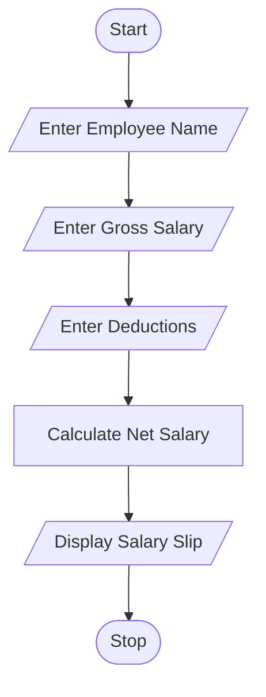
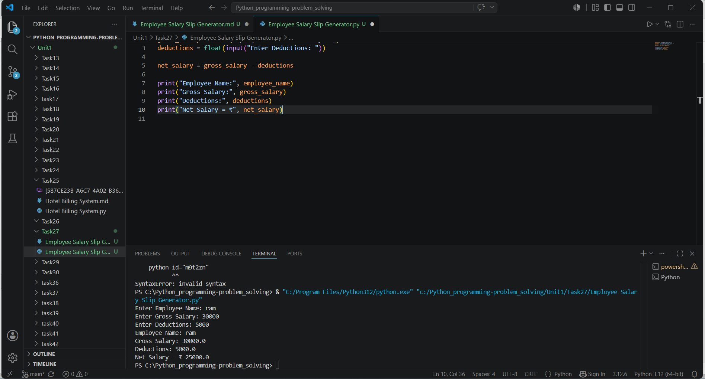

# Employee Salary Slip Generator

## 1. Problem Statement

Develop a Python program to generate an employee salary slip with 
gross salary, deductions, and net salary. 

---

## 2. Algorithm

1. Start

2. Input employee name

3. Input gross salary

4. Input deductions

5. Calculate net salary:

   * Net Salary = Gross Salary - Deductions

6. Display all salary details and net salary

7. Stop

---

## 3. Flowchart


---

## 4. Python Source Code

```employee_name = input("Enter Employee Name: ")
gross_salary = float(input("Enter Gross Salary: "))
deductions = float(input("Enter Deductions: "))

net_salary = gross_salary - deductions

print("Employee Name:", employee_name)
print("Gross Salary:", gross_salary)
print("Deductions:", deductions)
print("Net Salary = ₹", net_salary)
```

---

## 5. Sample Input / Output

### Sample 1:

Input:

```text id="a2r7mc"
Enter Employee Name: Ravi
Enter Gross Salary: 30000
Enter Deductions: 5000
```

Output:

```text id="k4p9wy"
Employee Name: Ravi
Gross Salary: 30000.0
Deductions: 5000.0
Net Salary = ₹ 25000.0
```

### Sample 2:

Input:

```text id="q8v3nd"
Enter Employee Name: Priya
Enter Gross Salary: 45000
Enter Deductions: 7000
```

Output:

```text id="t6j2xe"
Employee Name: Priya
Gross Salary: 45000.0
Deductions: 7000.0
Net Salary = ₹ 38000.0
```

---

## 6. Screenshots


---

