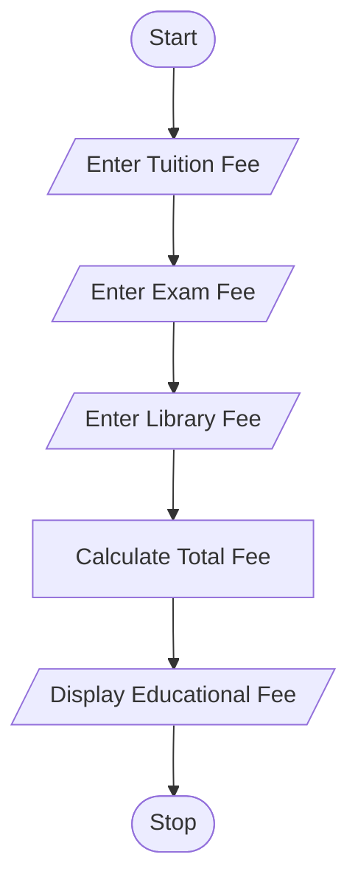

# Educational Fee Calculator

## 1. Problem Statement

Write a Python program to calculate the total educational fee payable by a student.

The program should accept tuition fee, exam fee, and library fee from the user and display the total fee.

---

## 2. Algorithm

1. Start

2. Input tuition fee

3. Input exam fee

4. Input library fee

5. Calculate total fee:

   * Total Fee = Tuition Fee + Exam Fee + Library Fee

6. Display all fee details and total amount

7. Stop

---

## 3. Flowchart



---

## 4. Python Source Code

```python
tuition_fee = float(input("Enter Tuition Fee: "))
exam_fee = float(input("Enter Exam Fee: "))
library_fee = float(input("Enter Library Fee: "))

total_fee = tuition_fee + exam_fee + library_fee

print("Tuition Fee:", tuition_fee)
print("Exam Fee:", exam_fee)
print("Library Fee:", library_fee)
print("Total Educational Fee = ₹", total_fee)
```

---

## 5. Sample Input / Output

### Sample 1:

Input:

```text
Enter Tuition Fee: 15000
Enter Exam Fee: 2000
Enter Library Fee: 1000
```

Output:

```text
Tuition Fee: 15000.0
Exam Fee: 2000.0
Library Fee: 1000.0
Total Educational Fee = ₹ 18000.0
```

### Sample 2:

Input:

```text
Enter Tuition Fee: 20000
Enter Exam Fee: 2500
Enter Library Fee: 1500
```

Output:

```text
Tuition Fee: 20000.0
Exam Fee: 2500.0
Library Fee: 1500.0
Total Educational Fee = ₹ 24000.0
```

---

## 6. Screenshots

---
