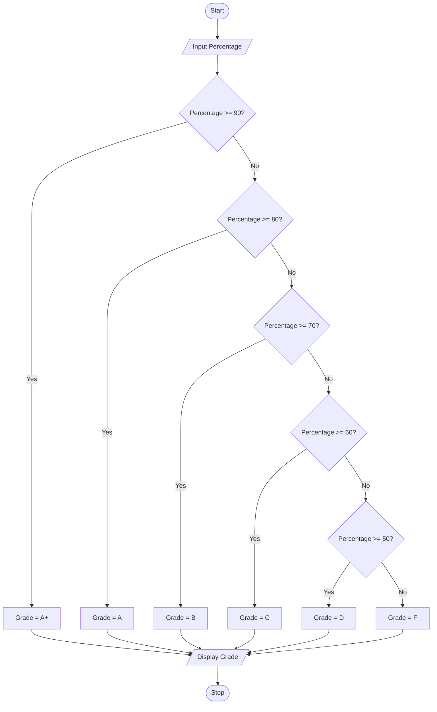

## Tutorial Task 29: Academic Grade Calculator

## 1. Problem Statement

Develop a Python program to determine student grades based on 
percentage.

## 2. Algorithm
1. Start the program.
2. Read the student's percentage.
3. Check if percentage is greater than or equal to 90.
4. If yes, assign grade A+.
5. Else check if percentage is greater than or equal to 80.
6. If yes, assign grade A.
7. Else check if percentage is greater than or equal to 70.
8. If yes, assign grade B.
9. Else check if percentage is greater than or equal to 60.
10. If yes, assign grade C.
11. Else check if percentage is greater than or equal to 50.
12. If yes, assign grade D.
13. Otherwise assign grade F.
14. Display the grade.
15. Stop the program.

## 3. Flowchart


--

## 4. Python Source Code
```
percentage = float(input("Enter percentage: "))

if percentage >= 90:
    grade = "A+"
elif percentage >= 80:
    grade = "A"
elif percentage >= 70:
    grade = "B"
elif percentage >= 60:
    grade = "C"
elif percentage >= 50:
    grade = "D"
else:
    grade = "F"

print("Grade:", grade)
```

## 5. Sample Input/Output
```
Sample Run 1
Enter percentage: 95
Grade: A+

Sample Run 2
Enter percentage: 82
Grade: A

Sample Run 3
Enter percentage: 74
Grade: B
```

## 6. Screenshots

