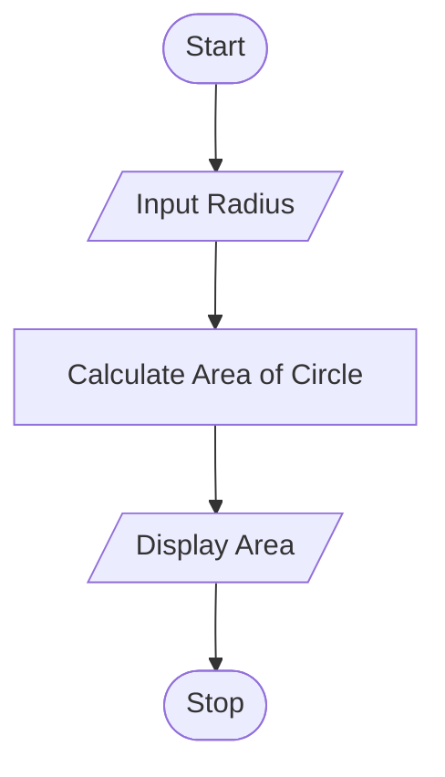

# Tutorial Task 4: Area of Circle Calculation

## 1. Problem Statement

Write a Python program to calculate the area of a circle for a given radius.

---

## 2. Algorithm

1. Start
2. Input Radius
3. Calculate Area of Circle
4. Display Area
5. Stop

---

## 3. Flowchart




---

## 4. Python Source Code

```python
radius = float(input("Enter Radius: "))

area = 3.14 * radius * radius

print("Area of Circle =", area)
```

---

## 5. Sample Input/Output

### Input

```text
Enter Radius: 7
```

### Output

```text
Area of Circle = 153.86
```
### Screenshot

