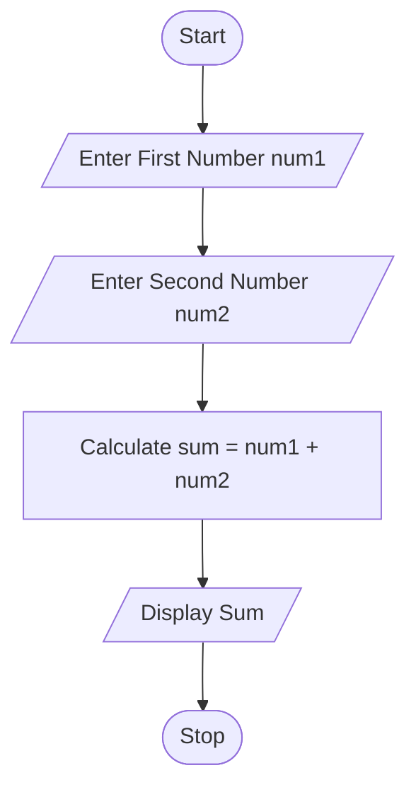
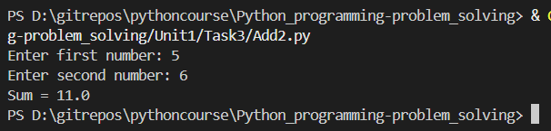

# Sum of Two Numbers Using Python

## 1. Problem Statement

Develop a Python program to read two numbers from the user and display their sum.

The program should accept two numbers as input, perform the addition operation, and display the result.

---

## 2. Algorithm

1. Start the program.

2. Input the first number `num1`.

3. Input the second number `num2`.

4. Calculate the sum using:

   `sum = num1 + num2`

5. Display the sum.

6. Stop the program.

---

## 3. Flowchart



---

## 4. Python Source Code

```python
num1 = float(input("Enter first number: "))
num2 = float(input("Enter second number: "))
sum_result = num1 + num2
print("Sum =", sum_result)
```
---

## 5. Sample Input/Output

### Example 1

**Input**

```text
Enter first number: 10
Enter second number: 20
```

**Output**

```text
Sum = 30.0
```

---

### Example 2

**Input**

```text
Enter first number: 15.5
Enter second number: 4.5
```

**Output**

```text
Sum = 20.0
```

---

## 6. Screenshots

