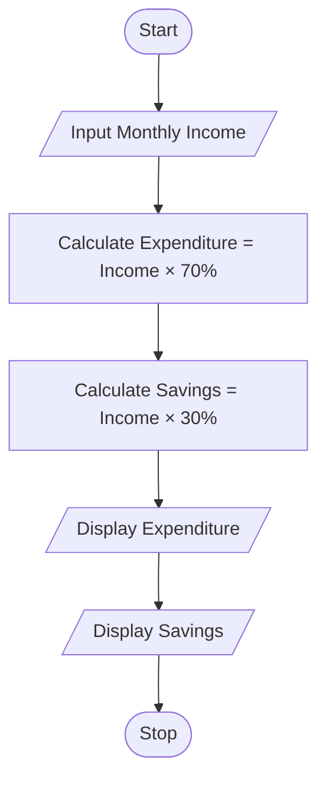
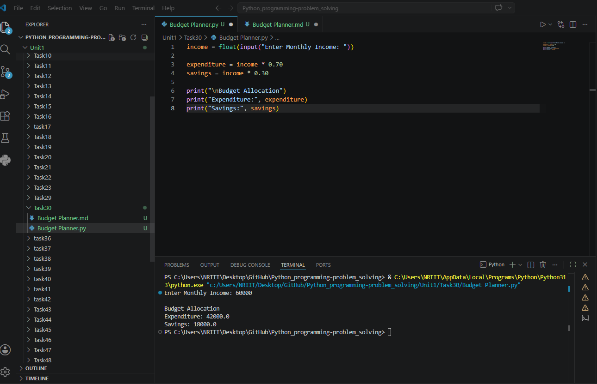

## Tutorial Task 30: Budget Planner

## 1. Problem Statement

 Develop a Python program to allocate monthly income into expenditure 
and savings categories. 

## 2. Algorithm

1. Start the program.
2. Input the monthly income.
3. Calculate expenditure as:
4. Expenditure = Income × 70 / 100
5. Calculate savings as:
6. Savings = Income × 30 / 100
7. Display expenditure amount.
8. Display savings amount.
9. Stop the program.

## 3. Flowchart (.md Format)




## 4. Python Source Code
```
income = float(input("Enter Monthly Income: "))

expenditure = income * 0.70
savings = income * 0.30

print("\nBudget Allocation")
print("Expenditure:", expenditure)
print("Savings:", savings)
```

## 5. Sample Input/Output

Sample Run 1
Enter Monthly Income: 50000

Budget Allocation
Expenditure: 35000.0
Savings: 15000.0

Sample Run 2
Enter Monthly Income: 30000

Budget Allocation
Expenditure: 21000.0
Savings: 9000.0

## 6. Screenshots

