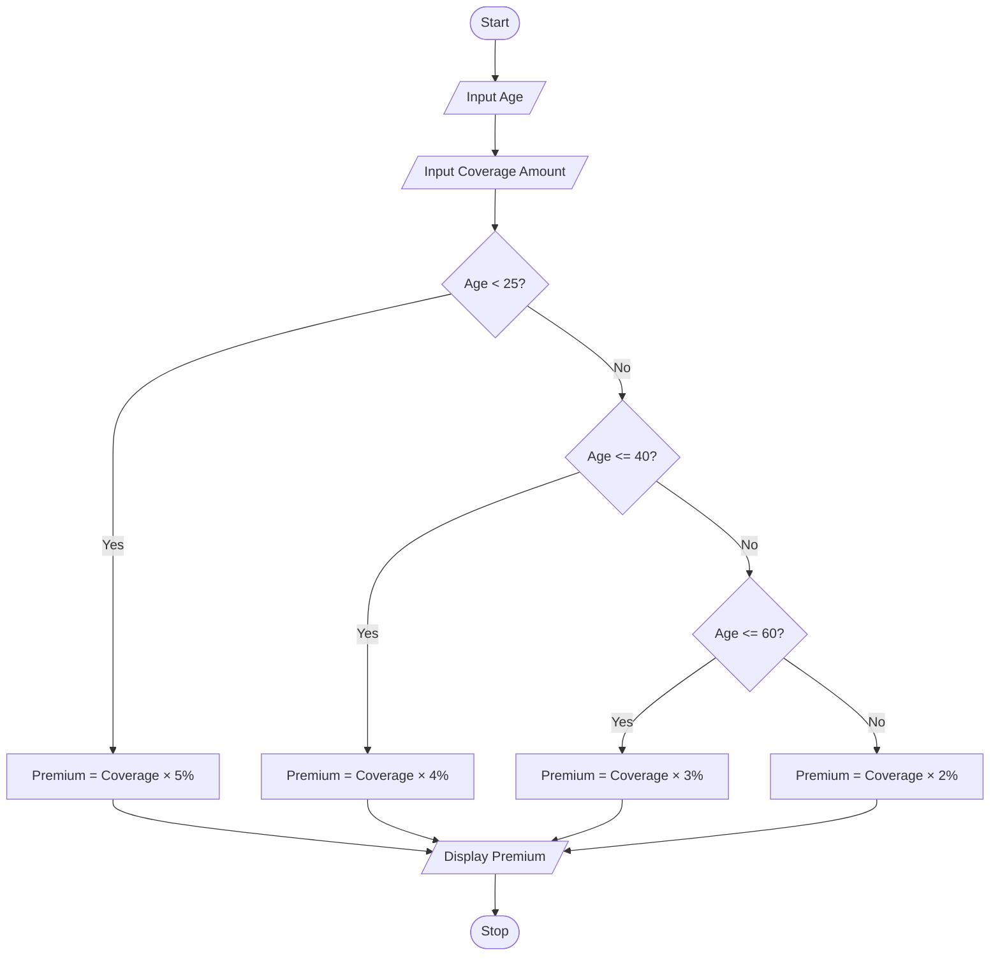
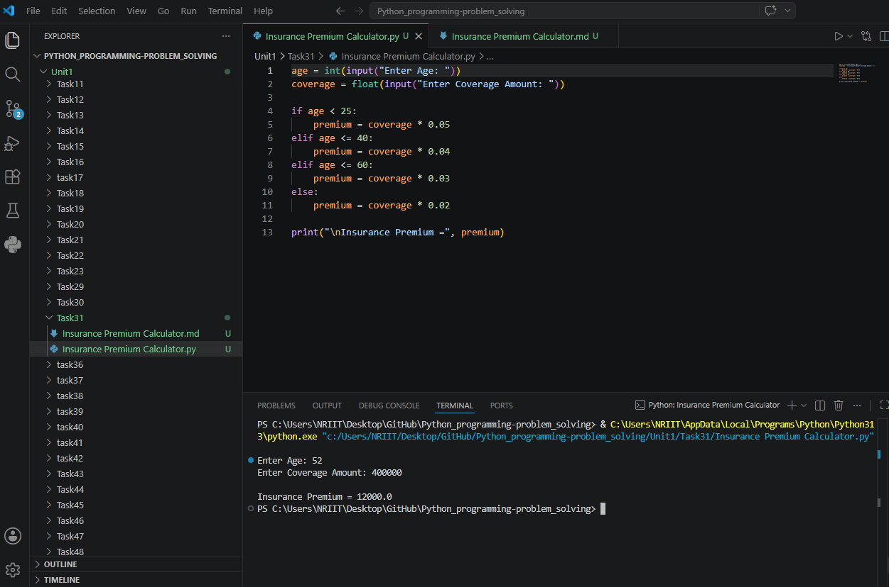

## Tutorial Task 31: Insurance Premium Calculator

## 1. Problem Statement
Develop a Python program to estimate insurance premium based on age 
and coverage amount.

## 2. Algorithm

1. Start the program.
2. Input the customer's age.
3. Input the coverage amount.
4. Check the age group:
5. If age < 25, premium = coverage × 5%.
6. Else if age ≤ 40, premium = coverage × 4%.
7. Else if age ≤ 60, premium = coverage × 3%.
8. Else, premium = coverage × 2%.
9. Display the premium amount.
10. Stop the program.

## 3. Flowchart (.md Format)



## 4. Python Source Code

```
age = int(input("Enter Age: "))
coverage = float(input("Enter Coverage Amount: "))

if age < 25:
    premium = coverage * 0.05
elif age <= 40:
    premium = coverage * 0.04
elif age <= 60:
    premium = coverage * 0.03
else:
    premium = coverage * 0.02

print("\nInsurance Premium =", premium)
```

## 5. Sample Input/Output

```
Sample Run 1
Enter Age: 22
Enter Coverage Amount: 500000
Insurance Premium = 25000.0

Sample Run 2
Enter Age: 35
Enter Coverage Amount: 500000
Insurance Premium = 20000.0
```

## 6. Screenshots


