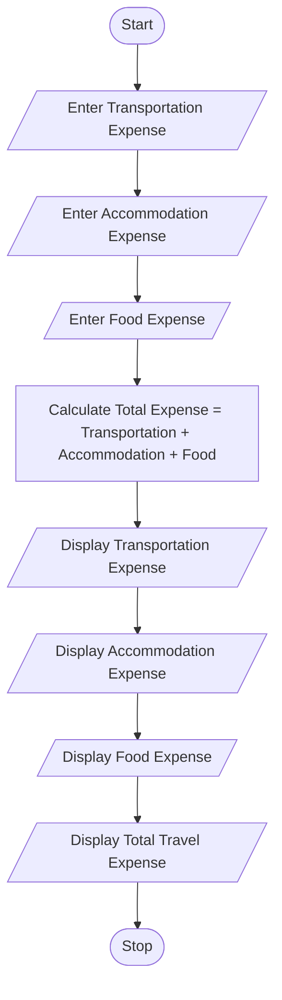
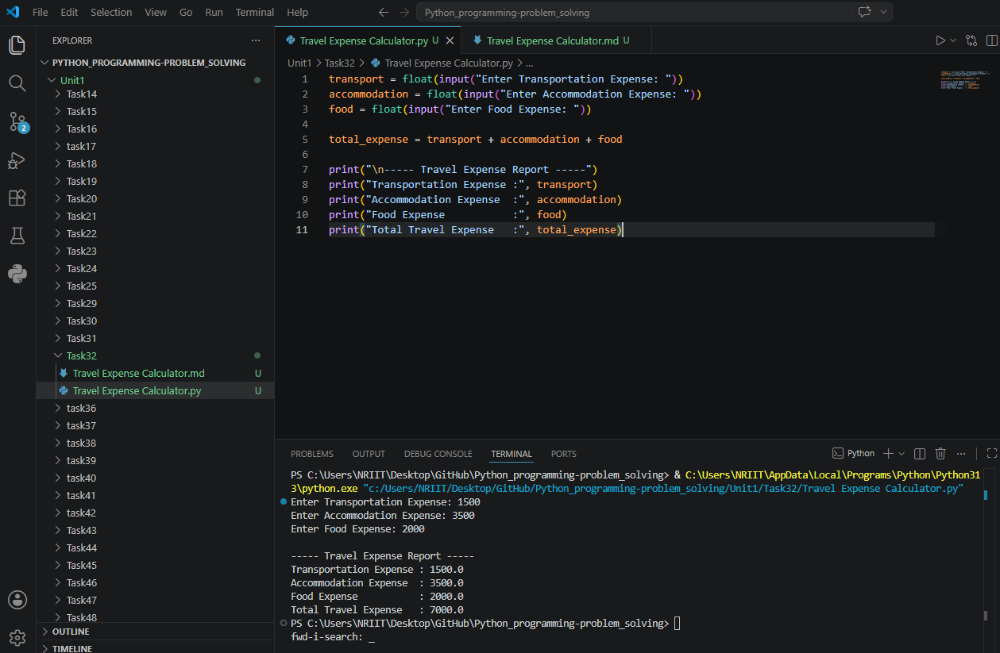

## Tutorial Task 32: Travel Expense Calculator

## 1. Problem Statement

Develop a Python program to calculate total travel expenditure 
including transportation, accommodation, and food expenses. 

## 2. Algorithm

1. Start the program.
2. Input transportation expense.
3. Input accommodation expense.
4. Input food expense.
5. Calculate total expenditure:
6. Total Expense = Transportation + Accommodation + Food
7. Display transportation expense.
8. Display accommodation expense.
9. Display food expense.
10. Display total travel expenditure.
11. Stop the program.

## 3. Flowchart



## 4. Python Source Code

```
transport = float(input("Enter Transportation Expense: "))
accommodation = float(input("Enter Accommodation Expense: "))
food = float(input("Enter Food Expense: "))

total_expense = transport + accommodation + food

print("\n----- Travel Expense Report -----")
print("Transportation Expense :", transport)
print("Accommodation Expense  :", accommodation)
print("Food Expense           :", food)
print("Total Travel Expense   :", total_expense)
```

## 5. Sample Input/Output

```
Sample Run 1

Input
Enter Transportation Expense: 2500
Enter Accommodation Expense: 4000
Enter Food Expense: 1500
Output
----- Travel Expense Report -----
Transportation Expense : 2500.0
Accommodation Expense  : 4000.0
Food Expense           : 1500.0
Total Travel Expense   : 8000.0

Sample Run 2
Input
Enter Transportation Expense: 1200
Enter Accommodation Expense: 3000
Enter Food Expense: 800
Output
----- Travel Expense Report -----
Transportation Expense : 1200.0
Accommodation Expense  : 3000.0
Food Expense           : 800.0
Total Travel Expense   : 5000.0
```

## 6. Screenshots


