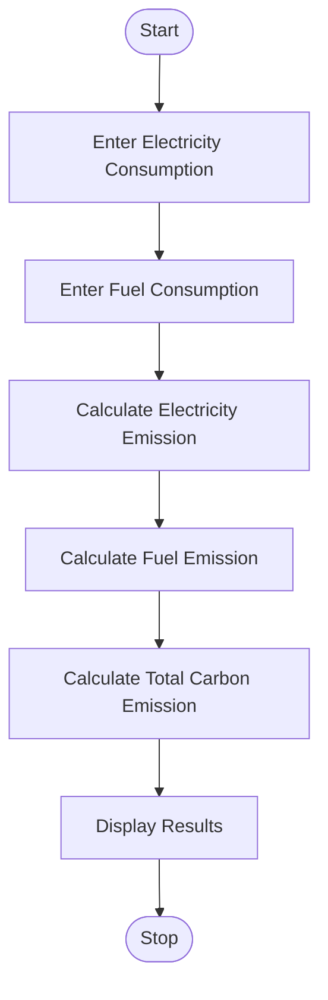

## Tutorial Task 33: Carbon Footprint Calculator

## 1. Problem Statement

Develop a Python program to estimate carbon emissions generated 
from electricity and fuel consumption.

## 2. Algorithm

1. Start the program.
2. Input electricity consumption in kWh.
3. Input fuel consumption in liters.
4. Calculate carbon emission from electricity:
5. Electricity Emission = Electricity × 0.85
6. Calculate carbon emission from fuel:
7. Fuel Emission = Fuel × 2.31
8. Calculate total carbon emission:
9. Total Emission = Electricity Emission + Fuel Emission
10. Display electricity emission.
11. Display fuel emission.
12. Display total carbon emission.
13. Stop the program.

## 3. Flowchart


## 4. Python Source Code

```
electricity = float(input("Enter Electricity Consumption (kWh): "))
fuel = float(input("Enter Fuel Consumption (Liters): "))

electricity_emission = electricity * 0.85
fuel_emission = fuel * 2.31

total_emission = electricity_emission + fuel_emission

print("\n----- Carbon Footprint Report -----")
print("Electricity Emission :", round(electricity_emission, 2), "kg CO2")
print("Fuel Emission        :", round(fuel_emission, 2), "kg CO2")
print("Total Emission       :", round(total_emission, 2), "kg CO2")
```

## 5. Sample Input/Output

Sample Run 1

Input

Enter Electricity Consumption (kWh): 250
Enter Fuel Consumption (Liters): 40

Output

----- Carbon Footprint Report -----
Electricity Emission : 212.5 kg CO2
Fuel Emission        : 92.4 kg CO2
Total Emission       : 304.9 kg CO2

Sample Run 2

Input

Enter Electricity Consumption (kWh): 100
Enter Fuel Consumption (Liters): 20

Output

----- Carbon Footprint Report -----
Electricity Emission : 85.0 kg CO2
Fuel Emission        : 46.2 kg CO2
Total Emission       : 131.2 kg CO2

## 6. Screenshots

