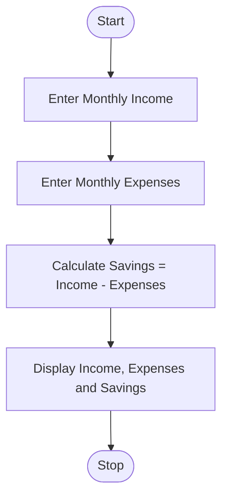
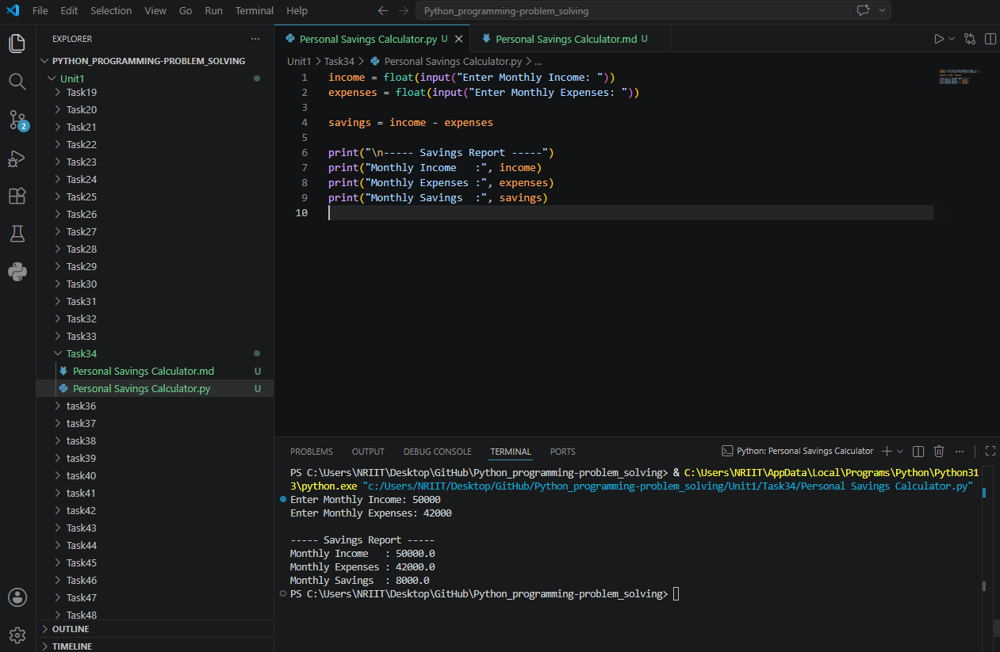

## Tutorial Task 34: Personal Savings Calculator

## 1. Problem Statement

Develop a Python program to calculate monthly savings based on 
income and expenses.

## 2. Algorithm

1. Start the program.
2. Input monthly income.
3. Input monthly expenses.
4. Calculate savings:
5. Savings = Income - Expenses
6. Display monthly income.
7. Display monthly expenses.
8. Display monthly savings.
9. Stop the program.

## 3. Flowchart



## 4. Python Source Code

```
income = float(input("Enter Monthly Income: "))
expenses = float(input("Enter Monthly Expenses: "))

savings = income - expenses

print("\n----- Savings Report -----")
print("Monthly Income   :", income)
print("Monthly Expenses :", expenses)
print("Monthly Savings  :", savings)
```

## 5. Sample Input/Output

```
Sample Run 1

Input

Enter Monthly Income: 50000
Enter Monthly Expenses: 35000

Output

----- Savings Report -----
Monthly Income   : 50000.0
Monthly Expenses : 35000.0
Monthly Savings  : 15000.0

Sample Run 2

Input

Enter Monthly Income: 30000
Enter Monthly Expenses: 22000

Output

----- Savings Report -----
Monthly Income   : 30000.0
Monthly Expenses : 22000.0
Monthly Savings  : 8000.0
```

## 6. Screenshots


