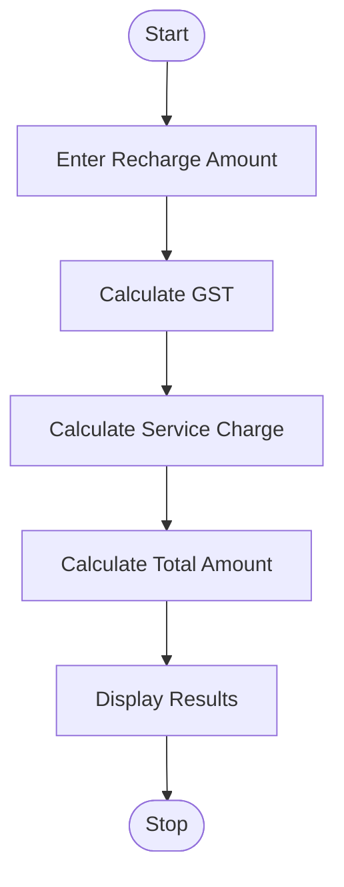
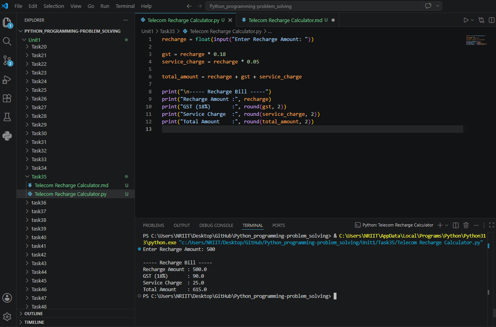

## Tutorial Task 35: Telecom Recharge Calculator

## 1. Problem Statement

Develop a Python program to calculate recharge amount including 
taxes and service charges. 

## 2. Algorithm

1. Start the program.
2. Input recharge amount.
3. Calculate GST:
4. GST = Recharge Amount × 18 / 100
5. Calculate Service Charge:
6. Service Charge = Recharge Amount × 5 / 100
7. Calculate Total Amount:
8. Total Amount = Recharge Amount + GST + Service Charge
9. Display recharge amount.
10. Display GST.
11. Display service charge.
12. Display total amount payable.
13. Stop the program.

## 3. Flowchart



## 4. Python Source Code

```
recharge = float(input("Enter Recharge Amount: "))

gst = recharge * 0.18
service_charge = recharge * 0.05

total_amount = recharge + gst + service_charge

print("\n----- Recharge Bill -----")
print("Recharge Amount :", recharge)
print("GST (18%)       :", round(gst, 2))
print("Service Charge  :", round(service_charge, 2))
print("Total Amount    :", round(total_amount, 2))
```

## 5. Sample Input/Output

Sample Run 1

Input

Enter Recharge Amount: 199

Output

----- Recharge Bill -----
Recharge Amount : 199.0
GST (18%)       : 35.82
Service Charge  : 9.95
Total Amount    : 244.77

Sample Run 2

Input

Enter Recharge Amount: 299

Output

----- Recharge Bill -----
Recharge Amount : 299.0
GST (18%)       : 53.82
Service Charge  : 14.95
Total Amount    : 367.77

## 6. Screenshots

