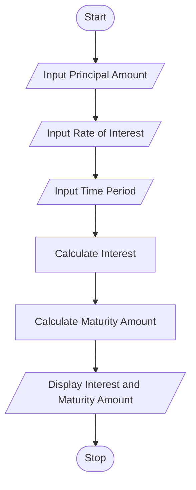

# Tutorial Task 43: Banking Interest Engine

## 1. Problem Statement

Develop a Python application to calculate savings interest and maturity values for banking customers.

---

## 2. Algorithm

1. Start
2. Input Principal Amount
3. Input Rate of Interest
4. Input Time Period
5. Calculate Simple Interest
6. Calculate Maturity Amount
7. Display Interest and Maturity Amount
8. Stop

---

## 3. Flowchart

### Mermaid Flowchart Code (.md)



---

## 4. Python Source Code

```python
principal = float(input("Enter Principal Amount: "))
rate = float(input("Enter Rate of Interest (%): "))
time = float(input("Enter Time Period (years): "))

interest = (principal * rate * time) / 100
maturity_amount = principal + interest

print("Interest =", interest)
print("Maturity Amount =", maturity_amount)
```

---

## 5. Sample Input/Output

### Input

```text
Enter Principal Amount: 10000
Enter Rate of Interest (%): 5
Enter Time Period (years): 2
```

### Output

```text
Interest = 1000.0
Maturity Amount = 11000.0
```
### Screenshot

