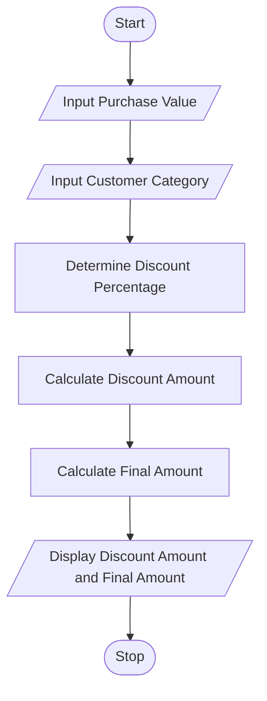

# Tutorial Task 44: E-Commerce Discount Engine

## 1. Problem Statement

Develop a Python application that automatically applies discount policies based on purchase value and customer category.

---

## 2. Algorithm

1. Start
2. Input Purchase Value
3. Input Customer Category
4. Determine Discount Percentage based on Customer Category
5. Calculate Discount Amount
6. Calculate Final Amount
7. Display Discount Amount and Final Amount
8. Stop

---

## 3. Flowchart




---

## 4. Python Source Code

```python
purchase_value = float(input("Enter Purchase Value: "))
category = input("Enter Customer Category (Gold/Silver/Regular): ").lower()

discounts = {"gold": 20, "silver": 10, "regular": 5}

discount_percent = discounts.get(category, 5)

discount_amount = purchase_value * discount_percent / 100
final_amount = purchase_value - discount_amount

print("Discount Amount =", discount_amount)
print("Final Amount =", final_amount)
```

---

## 5. Sample Input/Output

### Input

```text
Enter Purchase Value: 5000
Enter Customer Category (Gold/Silver/Regular): Gold
```

### Output

```text
Discount Amount = 1000.0
Final Amount = 4000.0
```
### Screenshot


