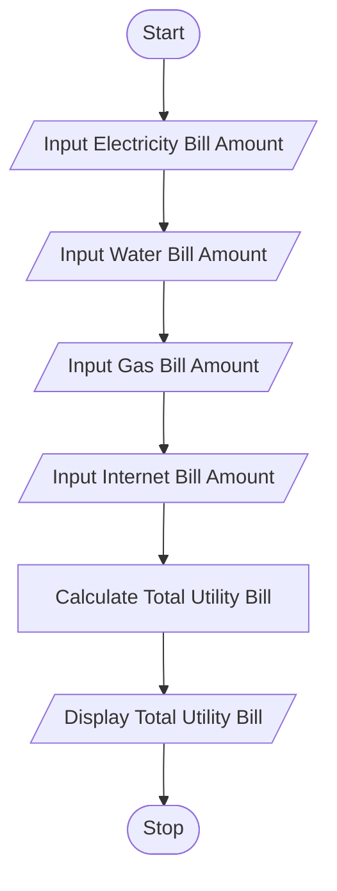

# Tutorial Task 45: Utility Billing System

## 1. Problem Statement

Develop a Python application to manage electricity, water, gas, and internet bill calculations.

---

## 2. Algorithm

1. Start
2. Input Electricity Bill Amount
3. Input Water Bill Amount
4. Input Gas Bill Amount
5. Input Internet Bill Amount
6. Calculate Total Utility Bill
7. Display Total Utility Bill
8. Stop

---

## 3. Flowchart

### Mermaid Flowchart Code (.md)



---

## 4. Python Source Code

```python
electricity_bill = float(input("Enter Electricity Bill Amount: "))
water_bill = float(input("Enter Water Bill Amount: "))
gas_bill = float(input("Enter Gas Bill Amount: "))
internet_bill = float(input("Enter Internet Bill Amount: "))

total_bill = electricity_bill + water_bill + gas_bill + internet_bill

print("Total Utility Bill =", total_bill)
```

---

## 5. Sample Input/Output

### Input

```text
Enter Electricity Bill Amount: 1200
Enter Water Bill Amount: 500
Enter Gas Bill Amount: 800
Enter Internet Bill Amount: 700
```

### Output

```text
Total Utility Bill = 3200.0
```
### Screenshot
5
