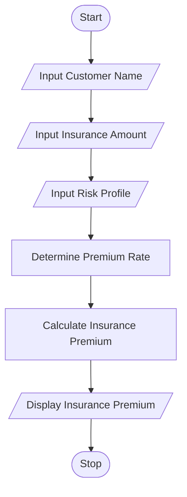

# Tutorial Task 46: Insurance Quotation Generator

## 1. Problem Statement

Develop a Python application to generate insurance quotations based on customer risk profiles.

---

## 2. Algorithm

1. Start
2. Input Customer Name
3. Input Insurance Amount
4. Input Risk Profile (Low, Medium, High)
5. Determine Premium Rate based on Risk Profile
6. Calculate Insurance Premium
7. Display Insurance Premium
8. Stop

---

## 3. Flowchart

### Mermaid Flowchart Code (.md)



---

## 4. Python Source Code

```python
customer_name = input("Enter Customer Name: ")
insurance_amount = float(input("Enter Insurance Amount: "))
risk_profile = input("Enter Risk Profile (Low/Medium/High): ").lower()

rates = {"low": 2, "medium": 5, "high": 8}

premium_rate = rates.get(risk_profile, 8)

premium = insurance_amount * premium_rate / 100

print("Customer Name =", customer_name)
print("Insurance Premium =", premium)

```

---

## 5. Sample Input/Output

### Input

```text
Enter Customer Name: Ramesh
Enter Insurance Amount: 500000
Enter Risk Profile (Low/Medium/High): Medium
```

### Output

```text
Customer Name = Ramesh
Insurance Premium = 25000.0
```
### Screenshot

