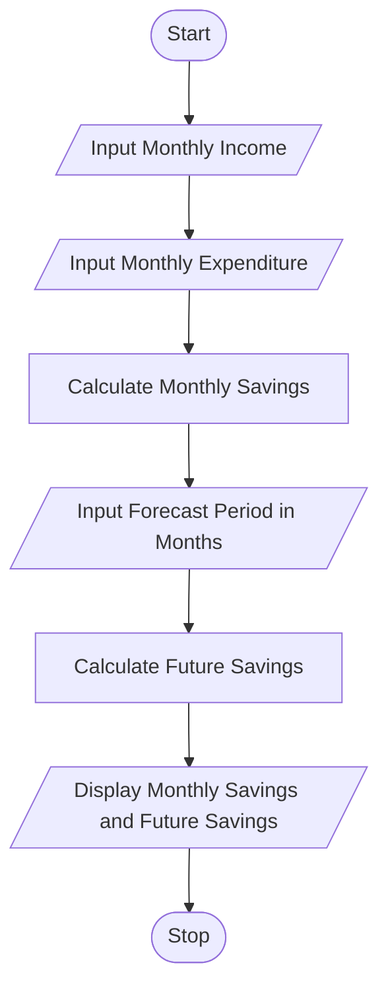

# Tutorial Task 47: Financial Forecast System

## 1. Problem Statement

Develop a Python application to forecast future financial growth based on income and expenditure patterns.

---

## 2. Algorithm

1. Start
2. Input Monthly Income
3. Input Monthly Expenditure
4. Calculate Monthly Savings
5. Input Forecast Period (Months)
6. Calculate Future Savings
7. Display Monthly Savings and Future Savings
8. Stop

---

## 3. Flowchart



---

## 4. Python Source Code

```python
income = float(input("Enter Monthly Income: "))
expenditure = float(input("Enter Monthly Expenditure: "))
months = int(input("Enter Forecast Period (Months): "))

monthly_savings = income - expenditure
future_savings = monthly_savings * months

print("Monthly Savings =", monthly_savings)
print("Future Savings =", future_savings)
```

---

## 5. Sample Input/Output

### Input

```text
Enter Monthly Income: 50000
Enter Monthly Expenditure: 35000
Enter Forecast Period (Months): 12
```

### Output

```text
Monthly Savings = 15000.0
Future Savings = 180000.0
```

### Screenshot

