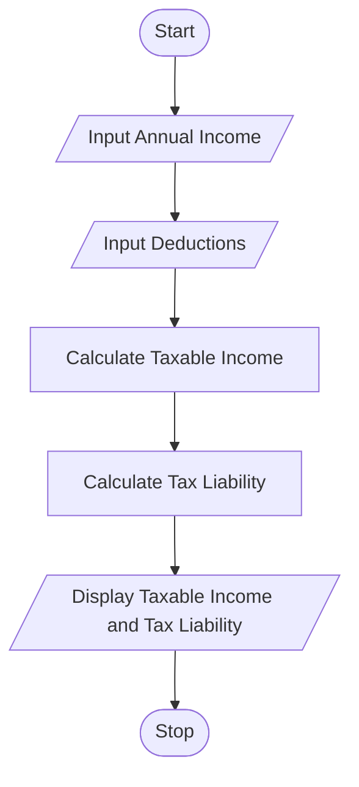

# Tutorial Task 48: Tax Filing Assistant

## 1. Problem Statement

Develop a Python application to assist users in estimating taxable income and tax liabilities.

---

## 2. Algorithm

1. Start
2. Input Annual Income
3. Input Deductions
4. Calculate Taxable Income
5. Calculate Tax Liability
6. Display Taxable Income and Tax Liability
7. Stop

---

## 3. Flowchart

### Mermaid Flowchart Code (.md)



---

## 4. Python Source Code

```python
annual_income = float(input("Enter Annual Income: "))
deductions = float(input("Enter Deductions: "))

taxable_income = annual_income - deductions
tax_liability = taxable_income * 0.10

print("Taxable Income =", taxable_income)
print("Tax Liability =", tax_liability)
```

---

## 5. Sample Input/Output

### Input

```text
Enter Annual Income: 800000
Enter Deductions: 100000
```

### Output

```text
Taxable Income = 700000.0
Tax Liability = 70000.0
```

### Screenshot


