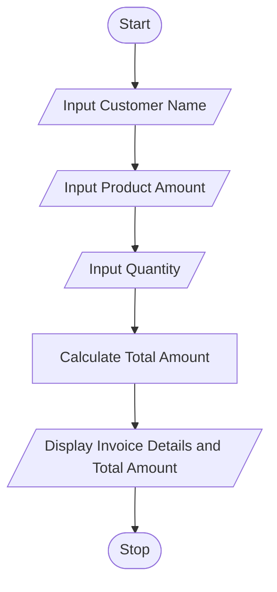

# Tutorial Task 49: Customer Billing Automation

## 1. Problem Statement

Develop a Python application that automates invoice generation and payment calculation for customers.

---

## 2. Algorithm

1. Start
2. Input Customer Name
3. Input Product Amount
4. Input Quantity
5. Calculate Total Amount
6. Display Invoice Details and Total Amount
7. Stop

---

## 3. Flowchart



---

## 4. Python Source Code

```python
customer_name = input("Enter Customer Name: ")
product_amount = float(input("Enter Product Amount: "))
quantity = int(input("Enter Quantity: "))

total_amount = product_amount * quantity

print("\n----- Invoice -----")
print("Customer Name =", customer_name)
print("Product Amount =", product_amount)
print("Quantity =", quantity)
print("Total Amount =", total_amount)
```

---

## 5. Sample Input/Output

### Input

```text
Enter Customer Name: Ramesh
Enter Product Amount: 500
Enter Quantity: 4
```

### Output

```text
----- Invoice -----
Customer Name = Ramesh
Product Amount = 500.0
Quantity = 4
Total Amount = 2000.0
```
### Screenshot


