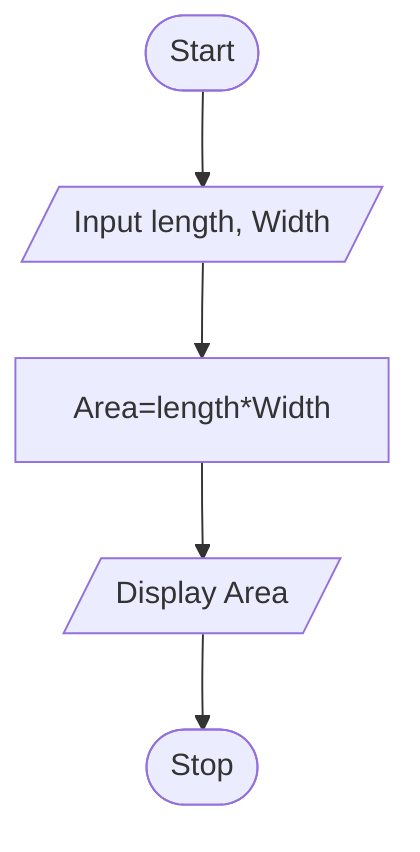
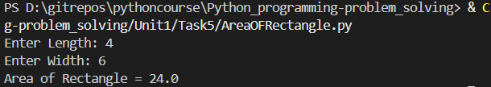

# Tutorial Task 5: Area of Recatangle Calculation

## 1. Problem Statement

Write a Python program to calculate the area of a rectangle using length and breadth.


## 2. Algorithm

1. Start
2. Input Rlength, breadth
3. Calculate Area of rectangle
4. Display Area
5. Stop

---

## 3. Flowchart




---

## 4. Python Source Code

```python
Length = float(input("Enter Length: "))
Width = float(input("Enter Width: "))
area = Length * Width
print("Area of Rectangle =", area)
```

---

## 5. Sample Input/Output

### Input

```text
Enter length: 7
Enter Width:6
```

### Output

```text
Area of Rectangle = 42.00
```
## 6. Screenshot

