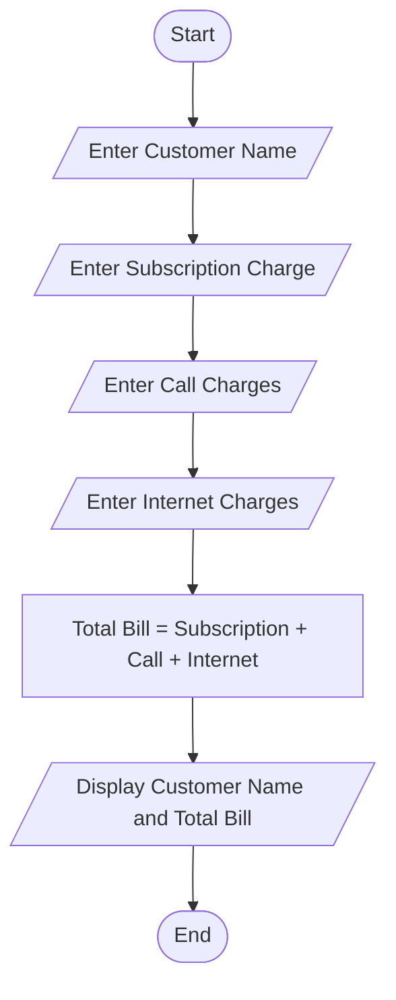

# Tutorial Task 50: Telecom Billing Engine

## Problem Statement

Develop a Python application to calculate telecom subscription charges and monthly bills.

---

## Algorithm

1. Start

2. Take the Input customer name from user.

3. Take the Input monthly subscription charge from user.

4. Take the Input call charges from user.

5. Take the Input internet/data charges from user.

6. Calculate total bill:

   Total Bill = Subscription Charge + Call Charges + Internet Charges

7. Display customer name and total bill

8. Stop

---

## Flowchart



---

## Python Source Code

```python
customer_name = input("Enter Customer Name: ")
subscription_charge = float(input("Enter Subscription Charge: "))
call_charges = float(input("Enter Call Charges: "))
internet_charges = float(input("Enter Internet Charges: "))

total_bill = subscription_charge + call_charges + internet_charges

print("\n----- Telecom Bill -----")
print("Customer Name:", customer_name)
print("Total Bill Amount: Rs.", total_bill)
```

---

## Sample Input/Output

### Input

```
Enter Customer Name: Bhuvaneswari
Enter Subscription Charge: 399
Enter Call Charges: 50
Enter Internet Charges: 100
```

### Output

```
----- Telecom Bill -----
Customer Name: Bhuvaneswari
Total Bill Amount: Rs. 549.0
```
### Screenshot
