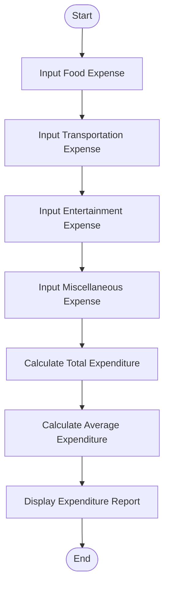

# Tutorial Task 51: Expense Analytics Tool

## Problem Statement

Develop a Python application to analyze spending behavior and generate expenditure reports.

---

## Algorithm

1. Start
2. Input food expenses.
3. Input transportation expenses.
4. Input entertainment expenses.
5. Input miscellaneous expenses.
6. Calculate total expenditure.
7. Calculate average expenditure.
8. Display expenditure report.
9. Stop.

---

## Flowchart



---

## Python Source Code

```python
food = float(input("Enter Food Expense: "))
transport = float(input("Enter Transportation Expense: "))
entertainment = float(input("Enter Entertainment Expense: "))
misc = float(input("Enter Miscellaneous Expense: "))

total = food + transport + entertainment + misc
average = total / 4

print("\n--- Expenditure Report ---")
print("Food Expense:", food)
print("Transportation Expense:", transport)
print("Entertainment Expense:", entertainment)
print("Miscellaneous Expense:", misc)
print("Total Expenditure:", total)
print("Average Expenditure:", average)
```

---

## Sample Input/Output

### Input

```
Enter Food Expense: 3000
Enter Transportation Expense: 1500
Enter Entertainment Expense: 1000
Enter Miscellaneous Expense: 500
```

### Output

```
--- Expenditure Report ---
Food Expense: 3000.0
Transportation Expense: 1500.0
Entertainment Expense: 1000.0
Miscellaneous Expense: 500.0
Total Expenditure: 6000.0
Average Expenditure: 1500.0
```

---

## Screenshot


> Run the program and save the output screenshot as `screenshot.png` in the repository folder.
