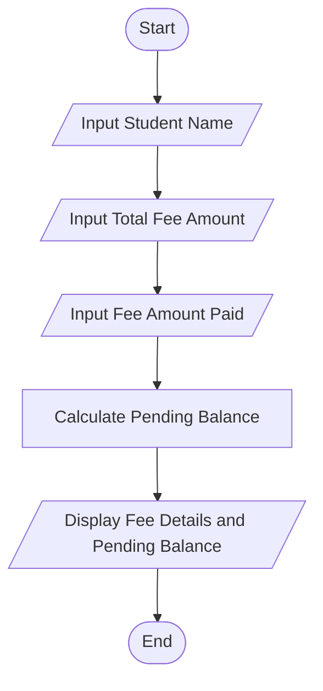

# Tutorial Task 52: Fee Collection System

## Problem Statement

Develop a Python application to calculate student fee collections and pending balances.

---

## Algorithm

1. Start

2. Input student name.

3. Input total fee amount.

4. Input fee amount paid.

5. Calculate pending balance.

   Pending Balance = Total Fee - Fee Paid

6. Display student name, total fee, fee paid, and pending balance.

7. Stop.

---

## Flowchart



---

## Python Source Code

```python
student_name = input("Enter Student Name: ")

total_fee = float(input("Enter Total Fee Amount: "))
fee_paid = float(input("Enter Fee Amount Paid: "))

pending_balance = total_fee - fee_paid

print("\n--- Fee Collection Report ---")
print("Student Name:", student_name)
print("Total Fee Amount:", total_fee)
print("Fee Paid:", fee_paid)
print("Pending Balance:", pending_balance)
```

---

## Sample Input/Output

### Input

```
Enter Student Name: Bhuvana
Enter Total Fee Amount: 50000
Enter Fee Amount Paid: 35000
```

### Output

```
--- Fee Collection Report ---
Student Name: Bhuvana
Total Fee Amount: 50000.0
Fee Paid: 35000.0
Pending Balance: 15000.0
```

---

## Screenshot

)

> Run the program and save the output screenshot as `screenshot.png` in the repository folder.
