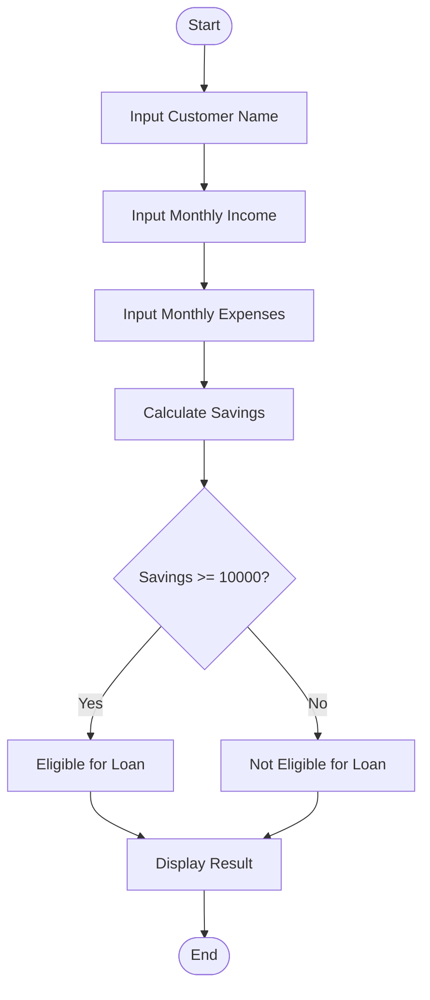

# Tutorial Task 53: Loan Eligibility Checker

## Problem Statement

Develop a Python application to evaluate customer eligibility for loans based on financial parameters.

---

## Algorithm

1. Start

2. Take the Input customer name from user.

3. Input monthly income.

4. Input monthly expenses.

5. Calculate savings.

   Savings = Monthly Income - Monthly Expenses

6. Check eligibility:

   * If savings are greater than or equal to 10000, customer is eligible for the loan.
   * Otherwise, customer is not eligible.

7. Display customer details, savings, and loan eligibility status.

8. Stop.

---

## Flowchart



---

## Python Source Code

```python
customer_name = input("Enter Customer Name: ")

monthly_income = float(input("Enter Monthly Income: "))
monthly_expenses = float(input("Enter Monthly Expenses: "))

savings = monthly_income - monthly_expenses

if savings >= 10000:
    status = "Eligible for Loan"
else:
    status = "Not Eligible for Loan"

print("\n--- Loan Eligibility Report ---")
print("Customer Name:", customer_name)
print("Monthly Income:", monthly_income)
print("Monthly Expenses:", monthly_expenses)
print("Savings:", savings)
print("Loan Status:", status)
```

---

## Sample Input/Output

### Input

```text
Enter Customer Name: Bhuvana
Enter Monthly Income: 50000
Enter Monthly Expenses: 35000
```

### Output

```text
--- Loan Eligibility Report ---
Customer Name: Bhuvana
Monthly Income: 50000.0
Monthly Expenses: 35000.0
Savings: 15000.0
Loan Status: Eligible for Loan
```

---

## Screenshot

)

> Run the program and save the output screenshot as `screenshot.png` in the repository folder.
