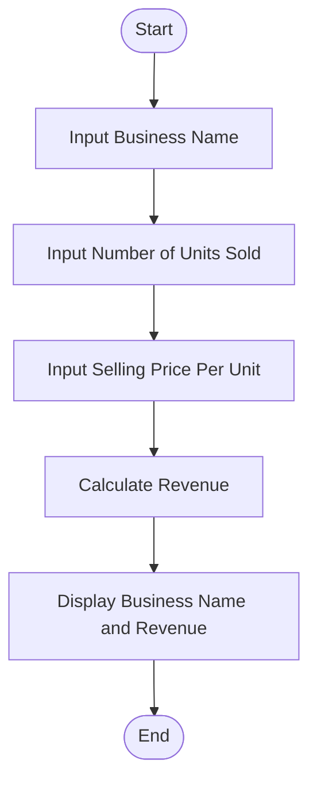

# Tutorial Task 54: Revenue Estimation Tool

## Problem Statement

Develop a Python application to estimate business revenue based on sales and operational inputs.

---

## Algorithm

1. Start

2. Take the Input business name from users.

3. Take the Input number of units sold from users.

4. Input selling price per unit.

5. Calculate revenue.

   Revenue = Units Sold × Selling Price Per Unit

6. Display business name and estimated revenue.

7. Stop.

---

## Flowchart



---

## Python Source Code

```python
business_name = input("Enter Business Name: ")

units_sold = int(input("Enter Number of Units Sold: "))
selling_price = float(input("Enter Selling Price Per Unit: "))

revenue = units_sold * selling_price

print("\n--- Revenue Estimation Report ---")
print("Business Name:", business_name)
print("Units Sold:", units_sold)
print("Selling Price Per Unit:", selling_price)
print("Estimated Revenue:", revenue)
```

---

## Sample Input/Output

### Input

```text
Enter Business Name: ABC Traders
Enter Number of Units Sold: 500
Enter Selling Price Per Unit: 250
```

### Output

```text
--- Revenue Estimation Report ---
Business Name: ABC Traders
Units Sold: 500
Selling Price Per Unit: 250.0
Estimated Revenue: 125000.0
```

---

## Screenshot

)

> Run the program and save the output screenshot as `screenshot.png` in the repository folder.
