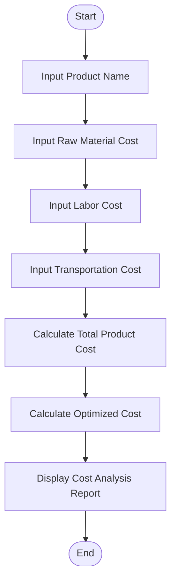
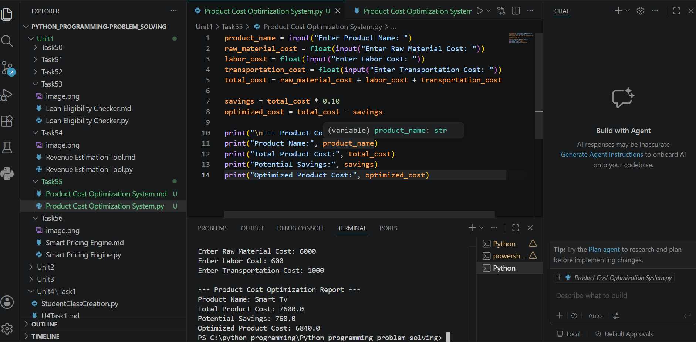

# Tutorial Task 55: Product Cost Optimization System

## Problem Statement

Develop a Python application to identify opportunities for reducing product costs.

---

## Algorithm

1. Start

2. Input product name.

3. Input raw material cost.

4. Input labor cost.

5. Input transportation cost.

6. Calculate total product cost.

   Total Cost = Raw Material Cost + Labor Cost + Transportation Cost

7. Calculate optimized cost by reducing total cost by 10%.

   Optimized Cost = Total Cost − (Total Cost × 10 / 100)

8. Display product name, total cost, savings amount, and optimized cost.

9. Stop.

---

## Flowchart



---

## Python Source Code

```python
product_name = input("Enter Product Name: ")
raw_material_cost = float(input("Enter Raw Material Cost: "))
labor_cost = float(input("Enter Labor Cost: "))
transportation_cost = float(input("Enter Transportation Cost: "))
total_cost = raw_material_cost + labor_cost + transportation_cost

savings = total_cost * 0.10
optimized_cost = total_cost - savings

print("\n--- Product Cost Optimization Report ---")
print("Product Name:", product_name)
print("Total Product Cost:", total_cost)
print("Potential Savings:", savings)
print("Optimized Product Cost:", optimized_cost)
```

---

## Sample Input/Output

### Input

```text
Enter Product Name: Mobile Phone
Enter Raw Material Cost: 12000
Enter Labor Cost: 3000
Enter Transportation Cost: 1000
```

### Output

```text
--- Product Cost Optimization Report ---
Product Name: Mobile Phone
Total Product Cost: 16000.0
Potential Savings: 1600.0
Optimized Product Cost: 14400.0
```

---

## Screenshot

> Run the program and save the output screenshot as `screenshot.png` in the repository folder.
