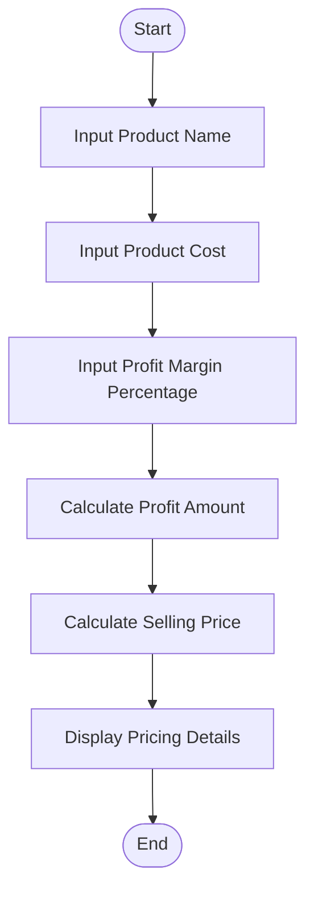

# Tutorial Task 56: Smart Pricing Engine

## Problem Statement

Develop a Python application to recommend optimal product pricing based on cost and profit margin.

---

## Algorithm

1. Start

2. Input product name.

3. Input product cost.

4. Input desired profit margin percentage.

5. Calculate profit amount.

   Profit Amount = Product Cost × Profit Margin / 100

6. Calculate recommended selling price.

   Selling Price = Product Cost + Profit Amount

7. Display product name, cost, profit amount, and recommended selling price.

8. Stop.

---

## Flowchart



---

## Python Source Code

```python
product_name = input("Enter Product Name: ")

cost = float(input("Enter Product Cost: "))
profit_margin = float(input("Enter Profit Margin Percentage: "))

profit_amount = cost * profit_margin / 100
selling_price = cost + profit_amount

print("\n--- Smart Pricing Report ---")
print("Product Name:", product_name)
print("Product Cost:", cost)
print("Profit Amount:", profit_amount)
print("Recommended Selling Price:", selling_price)
```

---

## Sample Input/Output

### Input

```text
Enter Product Name: Laptop
Enter Product Cost: 50000
Enter Profit Margin Percentage: 20
```

### Output

```text
--- Smart Pricing Report ---
Product Name: Laptop
Product Cost: 50000.0
Profit Amount: 10000.0
Recommended Selling Price: 60000.0
```

---

## Screenshot

)

> Run the program and save the output screenshot as `screenshot.png` in the repository folder.
