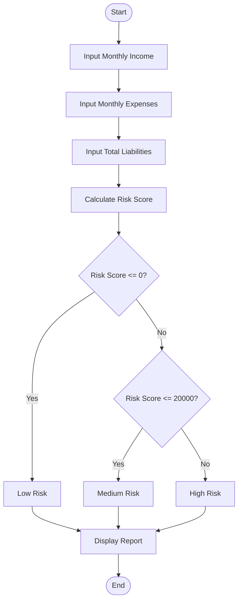
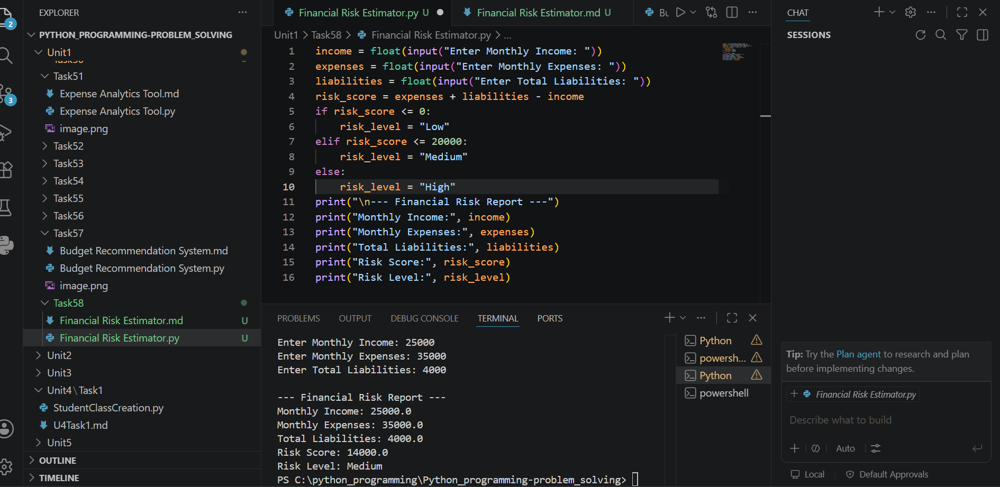

# Tutorial Task 58: Financial Risk Estimator

## Problem Statement

Develop a Python application to estimate financial risk using income, expenses, and liabilities.

---

## Algorithm

1. Start

2. Input monthly income.

3. Input monthly expenses.

4. Input total liabilities.

5. Calculate risk score.

   Risk Score = Expenses + Liabilities - Income

6. Determine risk level:

   * If Risk Score ≤ 0, Risk Level = Low
   * If Risk Score > 0 and ≤ 20000, Risk Level = Medium
   * If Risk Score > 20000, Risk Level = High

7. Display income, expenses, liabilities, risk score, and risk level.

8. Stop.

---

## Flowchart



---

## Python Source Code

```python
income = float(input("Enter Monthly Income: "))
expenses = float(input("Enter Monthly Expenses: "))
liabilities = float(input("Enter Total Liabilities: "))

risk_score = expenses + liabilities - income

if risk_score <= 0:
    risk_level = "Low"
elif risk_score <= 20000:
    risk_level = "Medium"
else:
    risk_level = "High"

print("\n--- Financial Risk Report ---")
print("Monthly Income:", income)
print("Monthly Expenses:", expenses)
print("Total Liabilities:", liabilities)
print("Risk Score:", risk_score)
print("Risk Level:", risk_level)
```

---

## Sample Input/Output

### Input

```text
Enter Monthly Income: 50000
Enter Monthly Expenses: 25000
Enter Total Liabilities: 10000
```

### Output

```text
--- Financial Risk Report ---
Monthly Income: 50000.0
Monthly Expenses: 25000.0
Total Liabilities: 10000.0
Risk Score: -15000.0
Risk Level: Low
```

---

## Screenshot

> Run the program and save the output screenshot as `screenshot.png` in the repository folder.
