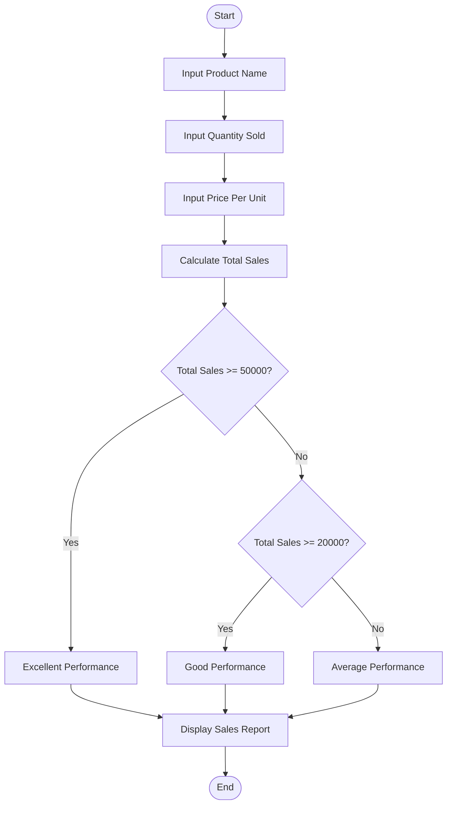
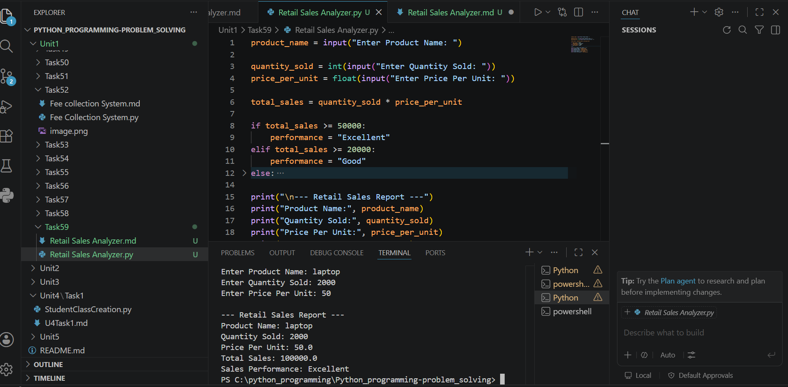

# Tutorial Task 59: Retail Sales Analyzer

## Problem Statement

Develop a Python application to analyze retail sales and generate business insights.

---

## Algorithm

1. Start

2. Input product name.

3. Input quantity sold.

4. Input price per unit.

5. Calculate total sales.

   Total Sales = Quantity Sold × Price per Unit

6. Determine business insight:

   * If Total Sales ≥ 50000, Sales Performance = Excellent
   * If Total Sales ≥ 20000 and < 50000, Sales Performance = Good
   * Otherwise, Sales Performance = Average

7. Display product details, total sales, and sales performance.

8. Stop.

---

## Flowchart



---

## Python Source Code

```python
product_name = input("Enter Product Name: ")

quantity_sold = int(input("Enter Quantity Sold: "))
price_per_unit = float(input("Enter Price Per Unit: "))

total_sales = quantity_sold * price_per_unit

if total_sales >= 50000:
    performance = "Excellent"
elif total_sales >= 20000:
    performance = "Good"
else:
    performance = "Average"

print("\n--- Retail Sales Report ---")
print("Product Name:", product_name)
print("Quantity Sold:", quantity_sold)
print("Price Per Unit:", price_per_unit)
print("Total Sales:", total_sales)
print("Sales Performance:", performance)
```

---

## Sample Input/Output

### Input

```text
Enter Product Name: Laptop
Enter Quantity Sold: 10
Enter Price Per Unit: 6000
```

### Output

```text
--- Retail Sales Report ---
Product Name: Laptop
Quantity Sold: 10
Price Per Unit: 6000.0
Total Sales: 60000.0
Sales Performance: Excellent
```

---

## Screenshot

> Run the program and save the output screenshot as `screenshot.png` in the repository folder.
