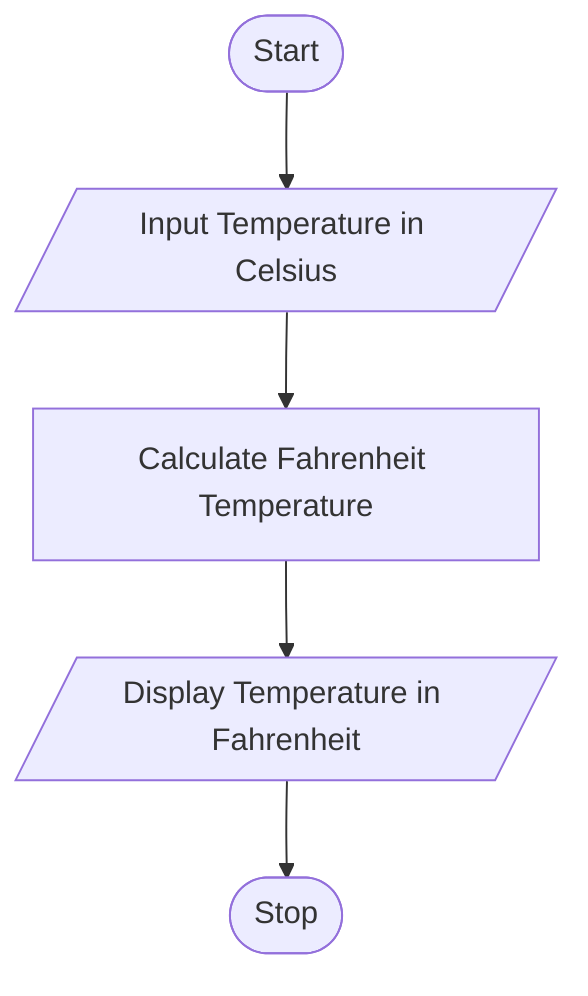

# Tutorial Task 6: Temperature Conversion

## 1. Problem Statement

Write a Python program to convert temperature from Celsius to Fahrenheit.

---

## 2. Algorithm

1. Start
2. Input Temperature in Celsius
3. Calculate Temperature in Fahrenheit
4. Display Temperature in Fahrenheit
5. Stop

---

## 3. Flowchart



---

## 4. Python Source Code

```python
celsius = float(input("Enter Temperature in Celsius: "))

fahrenheit = (celsius * 9/5) + 32

print("Temperature in Fahrenheit =", fahrenheit)
```

---

## 5. Sample Input/Output

### Input

```text
Enter Temperature in Celsius: 25
```

### Output

```text
Temperature in Fahrenheit = 77.0
```

### Screenshot


