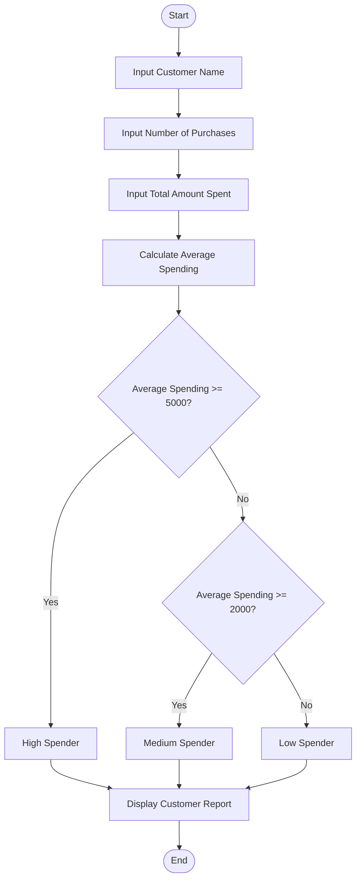
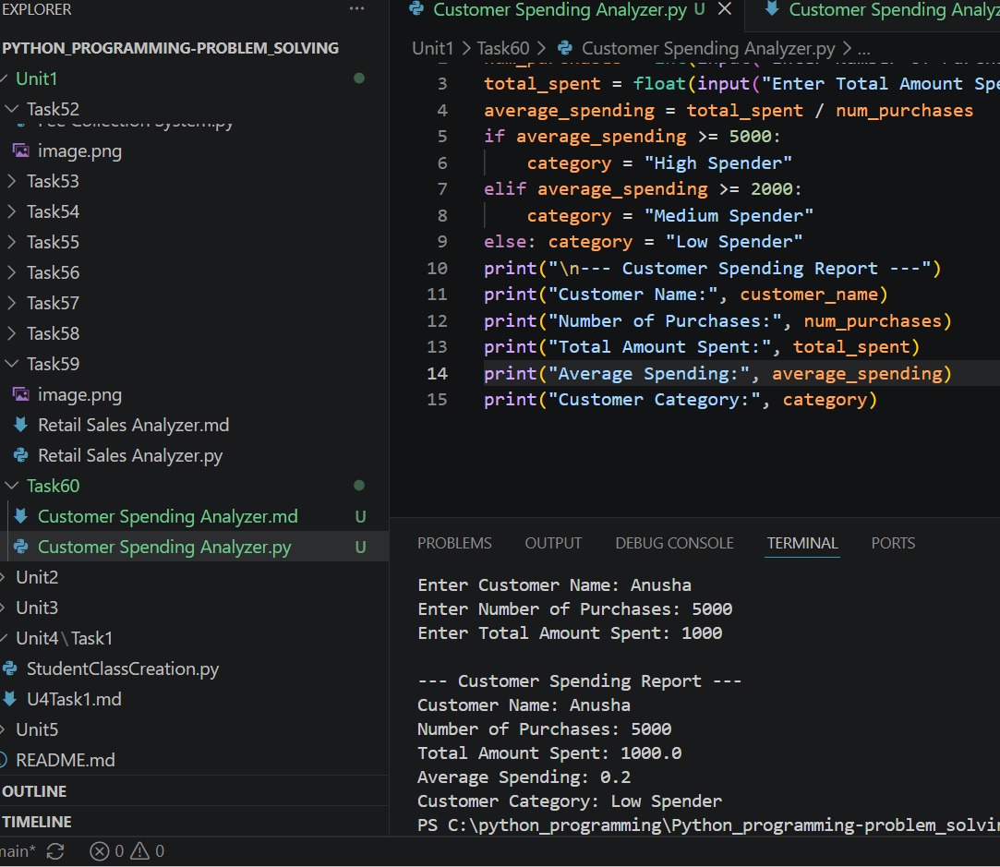

# Tutorial Task 60: Customer Spending Analyzer

## Problem Statement

Develop a Python application to analyze customer spending behavior and purchasing trends.

---

## Algorithm

1. Start

2. Input customer name.

3. Input number of purchases.

4. Input total amount spent.

5. Calculate average spending per purchase.

   Average Spending = Total Amount Spent ÷ Number of Purchases

6. Determine spending category:

   * If Average Spending ≥ 5000, Category = High Spender
   * If Average Spending ≥ 2000 and < 5000, Category = Medium Spender
   * Otherwise, Category = Low Spender

7. Display customer details, average spending, and spending category.

8. Stop.

---

## Flowchart



---

## Python Source Code

```python
customer_name = input("Enter Customer Name: ")

num_purchases = int(input("Enter Number of Purchases: "))
total_spent = float(input("Enter Total Amount Spent: "))

average_spending = total_spent / num_purchases

if average_spending >= 5000:
    category = "High Spender"
elif average_spending >= 2000:
    category = "Medium Spender"
else:
    category = "Low Spender"

print("\n--- Customer Spending Report ---")
print("Customer Name:", customer_name)
print("Number of Purchases:", num_purchases)
print("Total Amount Spent:", total_spent)
print("Average Spending:", average_spending)
print("Customer Category:", category)
```

---

## Sample Input/Output

### Input

```text
Enter Customer Name: Bhuvana
Enter Number of Purchases: 5
Enter Total Amount Spent: 30000
```

### Output

```text
--- Customer Spending Report ---
Customer Name: Bhuvana
Number of Purchases: 5
Total Amount Spent: 30000.0
Average Spending: 6000.0
Customer Category: High Spender
```

---

## Screenshot

> Run the program and save the output screenshot as `screenshot.png` in the repository folder.
