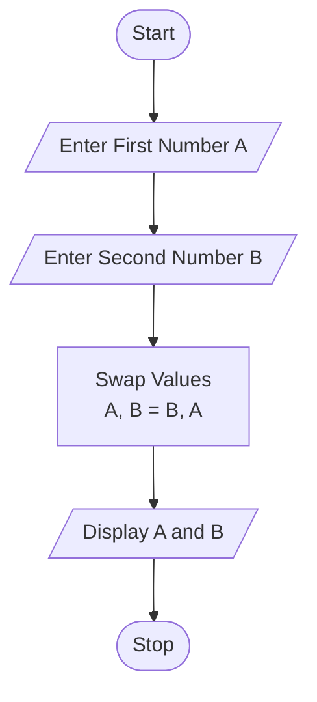

Tutorial Task 8: Swap Two Variables
1. Problem Statement

Write a Python program to interchange the values of two variables and display the result.

2. Algorithm
Start
Input two variables A and B
Swap the values of A and B using a temporary variable or Python's multiple assignment
Display the swapped values
Stop

4. Python Source Code
a = int(input("Enter First Number: "))
b = int(input("Enter Second Number: "))

# Swapping values
a, b = b, a

print("After Swapping:")
print("A =", a)
print("B =", b)
5. Sample Input/Output
Input
Enter First Number: 10
Enter Second Number: 20
Output
After Swapping:
A = 20
B = 10