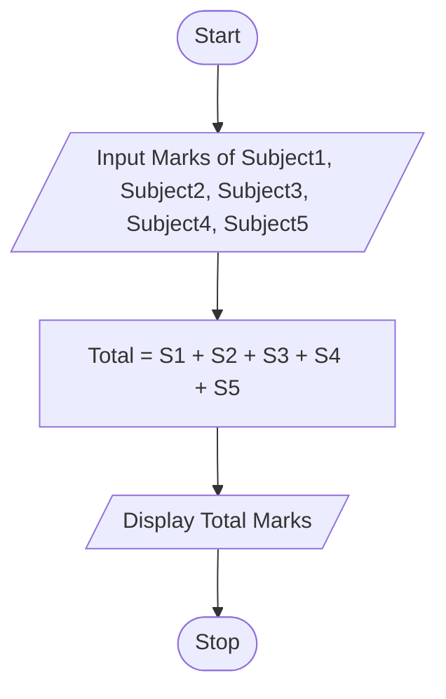

Here is the complete content for **Tutorial Task 9: Student Marks Calculator**.

# Tutorial Task 9: Student Marks Calculator

## 1. Problem Statement

Write a Python program to calculate the total marks obtained by a student in five subjects and display the result.

---

## 2. Algorithm

1. Start
2. Input marks of five subjects
3. Calculate the total marks by adding all five subject marks
4. Display the total marks
5. Stop

---

## 3. Flowchart

### Mermaid Flowchart Code (.md)



---

## 4. Python Source Code

```python
m1 = int(input("Enter Marks of Subject 1: "))
m2 = int(input("Enter Marks of Subject 2: "))
m3 = int(input("Enter Marks of Subject 3: "))
m4 = int(input("Enter Marks of Subject 4: "))
m5 = int(input("Enter Marks of Subject 5: "))

total = m1 + m2 + m3 + m4 + m5

print("Total Marks =", total)
```

---

## 5. Sample Input/Output

### Input

```text
Enter Marks of Subject 1: 85
Enter Marks of Subject 2: 90
Enter Marks of Subject 3: 78
Enter Marks of Subject 4: 88
Enter Marks of Subject 5: 92
```

### Output

```text
Total Marks = 433
``
