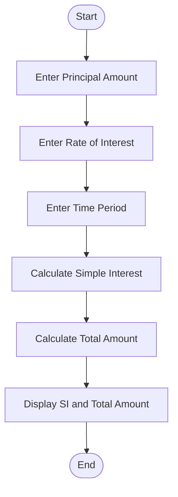
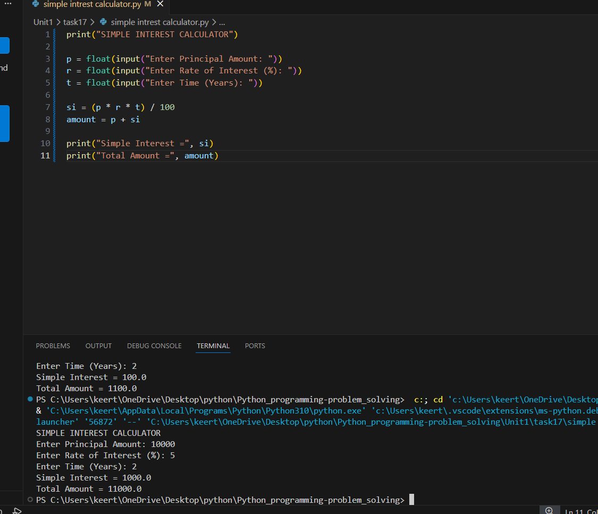

# Tutorial Task 17: Simple Interest Calculator

## 1. Problem Statement

Develop a Python program to calculate simple interest and total amount payable.

---

## 2. Algorithm

1. Start
2. Input Principal Amount (P)
3. Input Rate of Interest (R)
4. Input Time Period (T)
5. Calculate Simple Interest

   SI = (P × R × T) / 100

6. Calculate Total Amount

   Amount = P + SI

7. Display Simple Interest and Total Amount
8. Stop

---

## 3. Flowchart

## 3. Flowchart



---

## 4. Python Source Code

```python
print("SIMPLE INTEREST CALCULATOR")

p = float(input("Enter Principal Amount: "))
r = float(input("Enter Rate of Interest (%): "))
t = float(input("Enter Time (Years): "))

si = (p * r * t) / 100
amount = p + si

print("Simple Interest =", si)
print("Total Amount =", amount)
```

---

## 5. Sample Input

```text
Enter Principal Amount: 10000
Enter Rate of Interest (%): 5
Enter Time (Years): 2
```

---

## 6. Sample Output

```text
Simple Interest = 1000.0
Total Amount = 11000.0
```

---

## 7. Screenshot



---

## 8. Explanation

The program accepts principal amount, rate of interest, and time period from the user. It calculates the simple interest using the standard formula and then determines the total amount payable. Both values are displayed on the screen.

---

## 9. Software Requirements

- Python 3.x
- Visual Studio Code
- GitHub