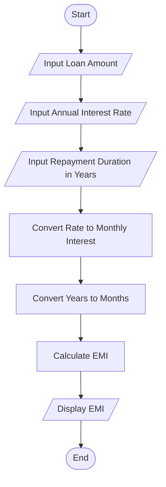
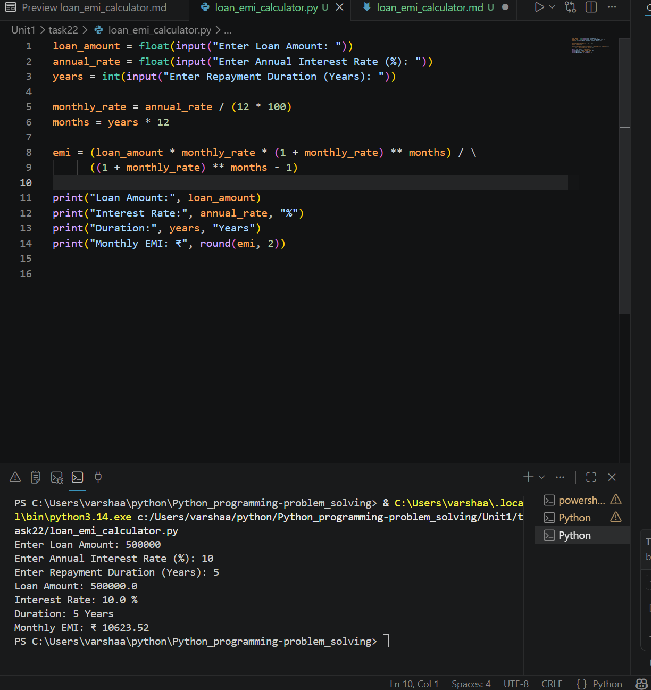

# Loan EMI Calculator

## 1. Problem Statement

Develop a Python program to calculate the Equated Monthly Installment (EMI) for a given loan amount, interest rate, and repayment duration.

---

## 2. Algorithm

1. Start the program.

2. Input loan amount (P).

3. Input annual interest rate (R).

4. Input repayment duration in years (N).

5. Convert annual interest rate to monthly interest rate:

   * r = R / (12 × 100)

6. Convert years to months:

   * n = N × 12

7. Calculate EMI using the formula:

   EMI = P × r × (1 + r)^n / ((1 + r)^n - 1)

8. Display the EMI amount.

9. End the program.

---

## 3. Flowchart



---

## 4. Python Source Code

```python


loan_amount = float(input("Enter Loan Amount: "))
annual_rate = float(input("Enter Annual Interest Rate (%): "))
years = int(input("Enter Repayment Duration (Years): "))

monthly_rate = annual_rate / (12 * 100)
months = years * 12

emi = (loan_amount * monthly_rate * (1 + monthly_rate) ** months) / \
      ((1 + monthly_rate) ** months - 1)

print("Loan Amount:", loan_amount)
print("Interest Rate:", annual_rate, "%")
print("Duration:", years, "Years")
print("Monthly EMI: ₹", round(emi, 2))
```

---

## 5. Sample Input/Output

### Sample Input

```text
Enter Loan Amount: 500000
Enter Annual Interest Rate (%): 10
Enter Repayment Duration (Years): 5
```

### Sample Output

```text
Loan Amount: 500000.0
Interest Rate: 10.0 %
Duration: 5 Years
Monthly EMI: ₹ 10623.52
```

### screenshot
