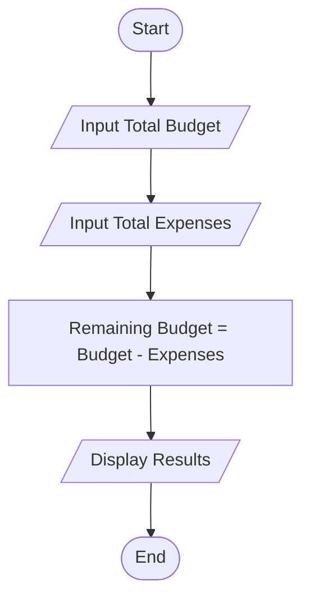
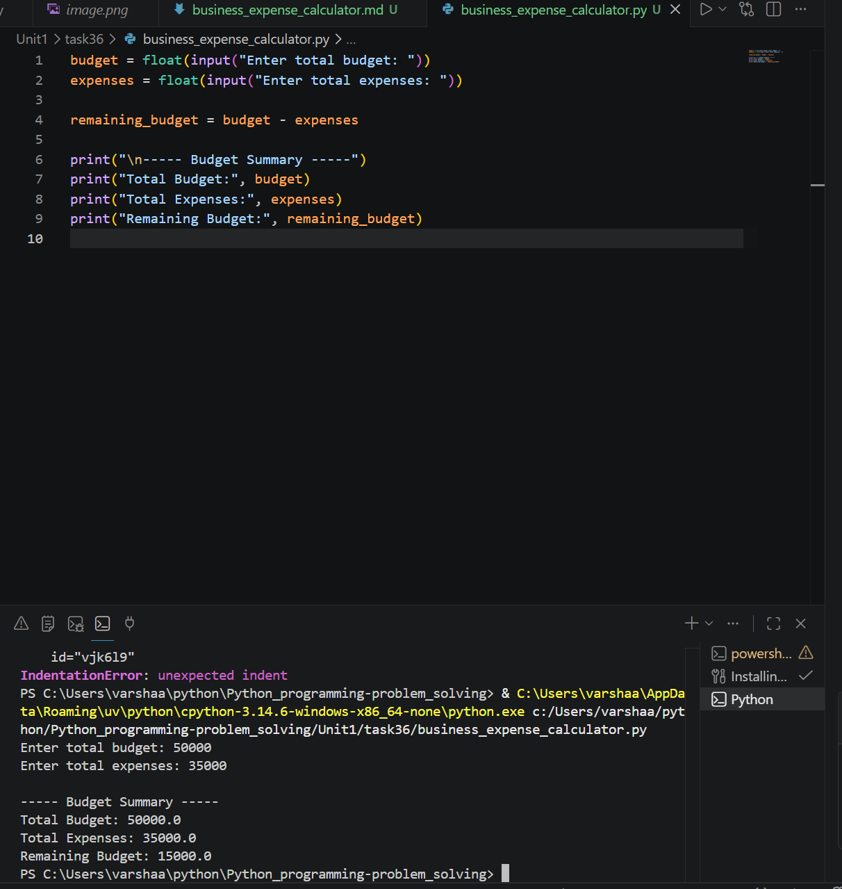

# Business Expense Calculator

## 1. Problem Statement

Develop a Python program to calculate business expenses and determine the remaining budget.

---

## 2. Algorithm

1. Start the program.
2. Input the total budget.
3. Input the total business expenses.
4. Calculate the remaining budget:

   * Remaining Budget = Total Budget - Total Expenses
5. Display the total budget, expenses, and remaining budget.
6. End the program.

---

## 3. Flowchart



---

## 4. Python Source Code

```python id="f5x1ko"
budget = float(input("Enter total budget: "))
expenses = float(input("Enter total expenses: "))

remaining_budget = budget - expenses

print("\n----- Budget Summary -----")
print("Total Budget:", budget)
print("Total Expenses:", expenses)
print("Remaining Budget:", remaining_budget)
```

---

## 5. Sample Input/Output

### Sample Input

```text id="7uy86g"
Enter total budget: 50000
Enter total expenses: 35000
```

### Sample Output

```text id="xyo5vn"
Total Budget: 50000.0
Total Expenses: 35000.0
Remaining Budget: 15000.0
```

### screenshot
