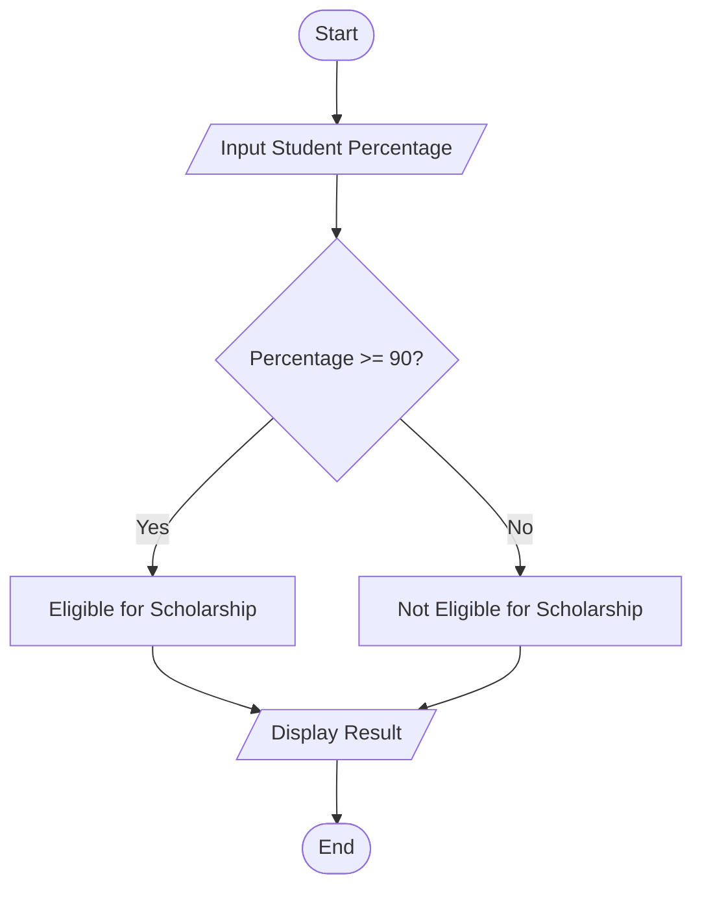
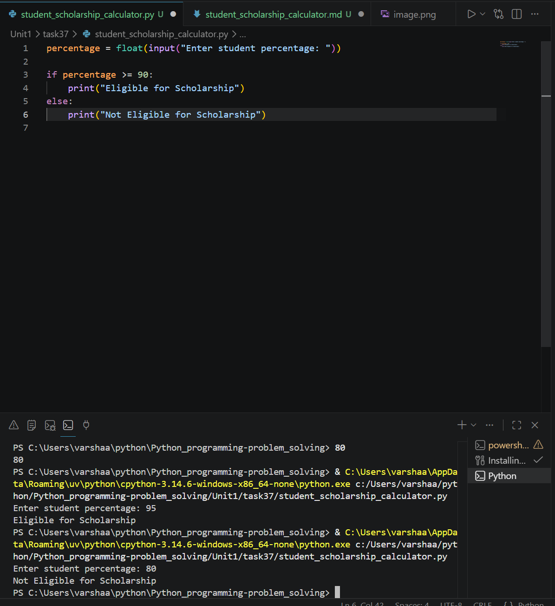

# Student Scholarship Calculator

## 1. Problem Statement

Develop a Python program to determine scholarship eligibility based on academic performance.

---

## 2. Algorithm

1. Start the program.
2. Input the student's percentage.
3. Check scholarship eligibility:

   * If percentage is 90 or above → Eligible for Scholarship.
   * Otherwise → Not Eligible for Scholarship.
4. Display the result.
5. End the program.

---

## 3. Flowchart



---

## 4. Python Source Code

```python95
percentage = float(input("Enter student percentage: "))

if percentage >= 90:
    print("Eligible for Scholarship")
else:
    print("Not Eligible for Scholarship")
```

---

## 5. Sample Input/Output

### Sample Input 1

```text
Enter student percentage: 95
```

### Sample Output 1

```text
Eligible for Scholarship
```

### Sample Input 2

```text
Enter student percentage: 80
```

### Sample Output 2

```text
Not Eligible for Scholarship
```

### screenshot
