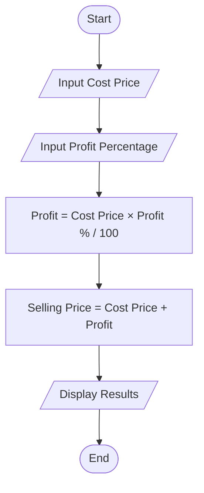
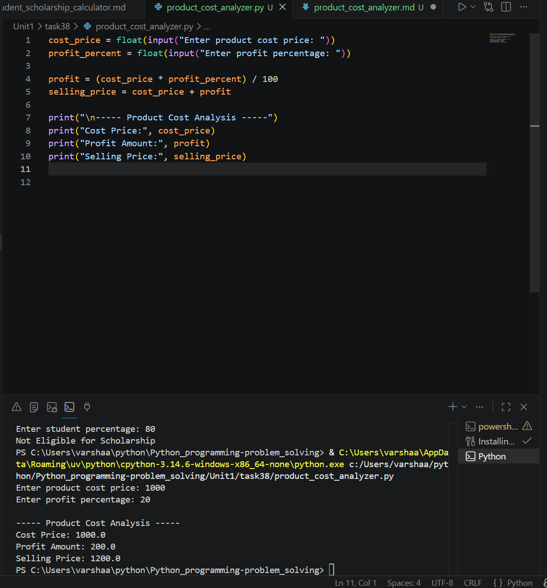

# Product Cost Analyzer

## 1. Problem Statement

Develop a Python program to analyze product cost and determine the final selling price.

---

## 2. Algorithm

1. Start the program.
2. Input the product cost price.
3. Input the profit percentage.
4. Calculate the profit amount:

   * Profit = Cost Price × Profit Percentage / 100
5. Calculate the selling price:

   * Selling Price = Cost Price + Profit
6. Display the cost price, profit amount, and selling price.
7. End the program.

---

## 3. Flowchart



---

## 4. Python Source Code

```python
cost_price = float(input("Enter product cost price: "))
profit_percent = float(input("Enter profit percentage: "))

profit = (cost_price * profit_percent) / 100
selling_price = cost_price + profit

print("\n----- Product Cost Analysis -----")
print("Cost Price:", cost_price)
print("Profit Amount:", profit)
print("Selling Price:", selling_price)
```

---

## 5. Sample Input/Output

### Sample Input

```text
Enter product cost price: 1000
Enter profit percentage: 20
```

### Sample Output

```text
Cost Price: 1000.0
Profit Amount: 200.0
Selling Price: 1200.0
```

### screenshot
