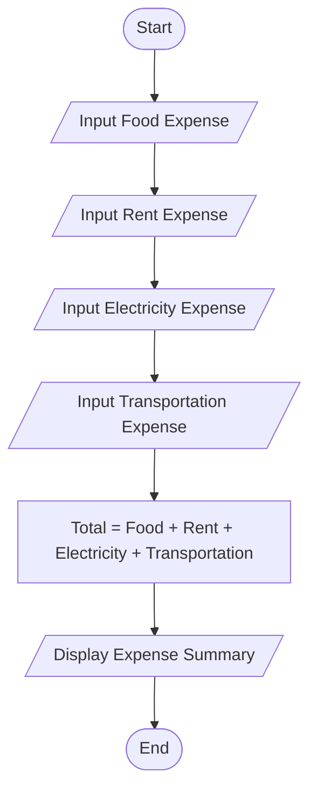
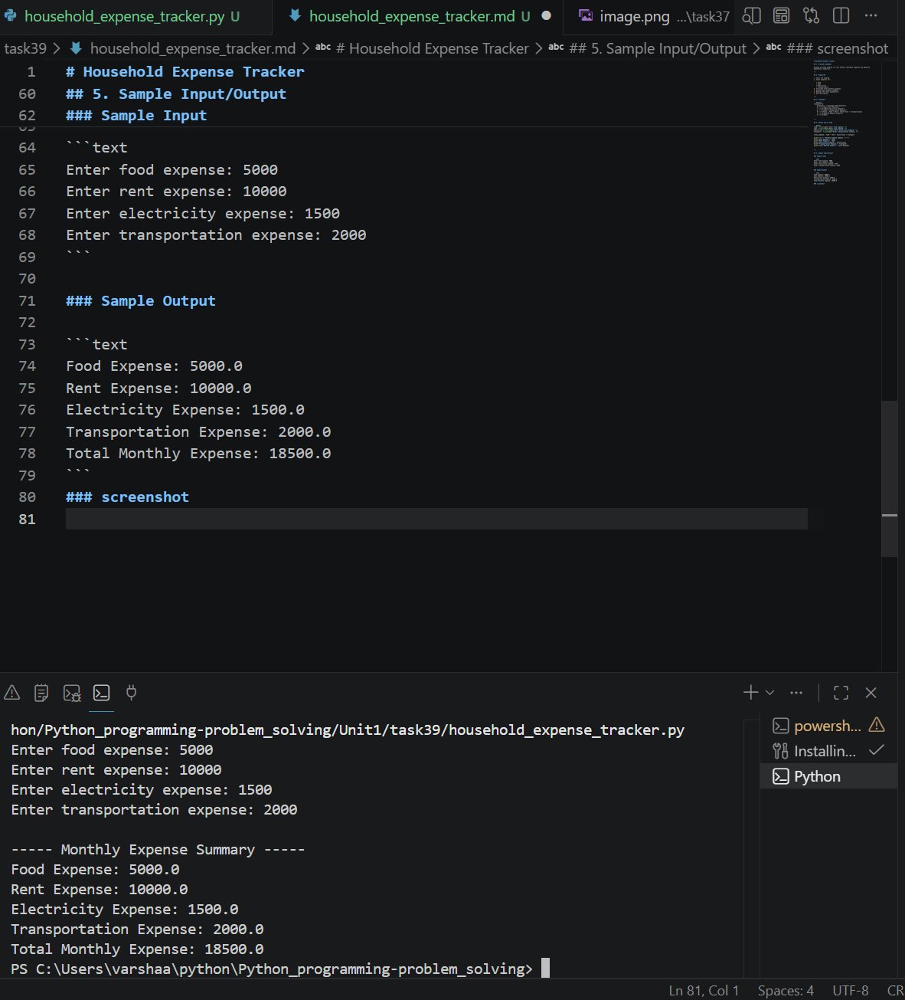

# Household Expense Tracker

## 1. Problem Statement

Develop a Python program to track monthly household expenses and generate expenditure summaries.

---

## 2. Algorithm

1. Start the program.
2. Input expenses for:

   * Food
   * Rent
   * Electricity
   * Transportation
3. Calculate total monthly expenses.
4. Display each expense category.
5. Display the total expenditure.
6. End the program.

---

## 3. Flowchart



---

## 4. Python Source Code

```python
food = float(input("Enter food expense: "))
rent = float(input("Enter rent expense: "))
electricity = float(input("Enter electricity expense: "))
transport = float(input("Enter transportation expense: "))

total_expense = food + rent + electricity + transport

print("\n----- Monthly Expense Summary -----")
print("Food Expense:", food)
print("Rent Expense:", rent)
print("Electricity Expense:", electricity)
print("Transportation Expense:", transport)
print("Total Monthly Expense:", total_expense)
```

---

## 5. Sample Input/Output

### Sample Input

```text
Enter food expense: 5000
Enter rent expense: 10000
Enter electricity expense: 1500
Enter transportation expense: 2000
```

### Sample Output

```text
Food Expense: 5000.0
Rent Expense: 10000.0
Electricity Expense: 1500.0
Transportation Expense: 2000.0
Total Monthly Expense: 18500.0
```
### screenshot
