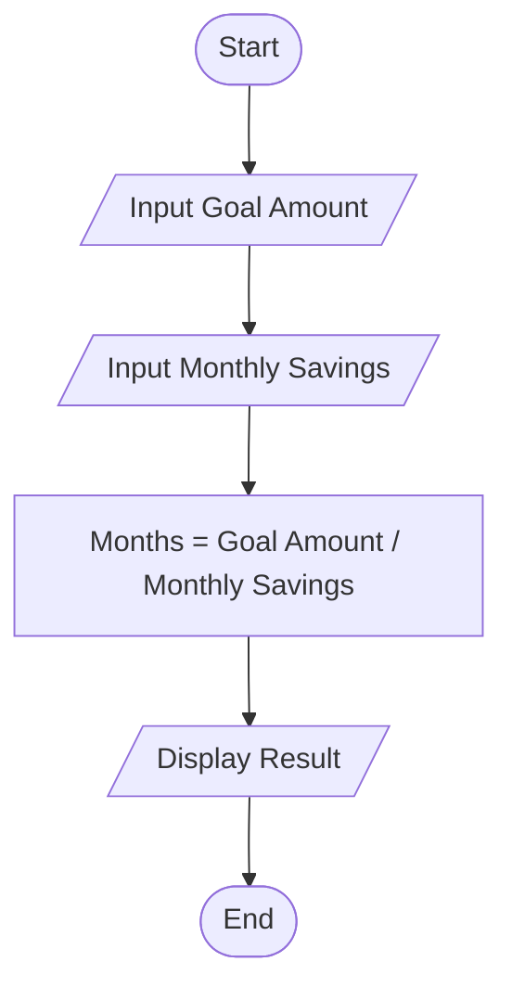
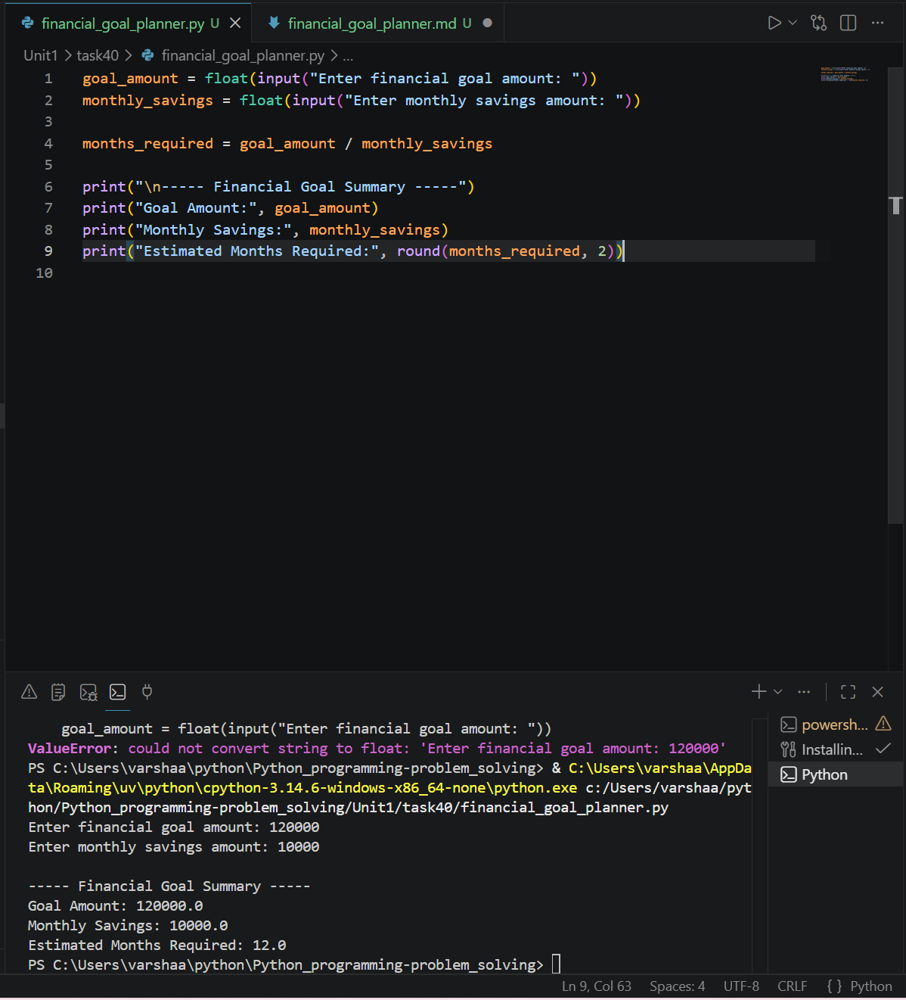

# Financial Goal Planner

## 1. Problem Statement

Develop a Python program to estimate the time required to achieve a financial goal based on monthly savings.

---

## 2. Algorithm

1. Start the program.
2. Input the financial goal amount.
3. Input the monthly savings amount.
4. Calculate the number of months required:

   * Months = Goal Amount / Monthly Savings
5. Display the goal amount, monthly savings, and estimated months.
6. End the program.

---

## 3. Flowchart



---

## 4. Python Source Code

```python
goal_amount = float(input("Enter financial goal amount: "))
monthly_savings = float(input("Enter monthly savings amount: "))

months_required = goal_amount / monthly_savings

print("\n----- Financial Goal Summary -----")
print("Goal Amount:", goal_amount)
print("Monthly Savings:", monthly_savings)
print("Estimated Months Required:", round(months_required, 2))
```

---

## 5. Sample Input/Output

### Sample Input

```text
Enter financial goal amount: 120000
Enter monthly savings amount: 10000
```

### Sample Output

```text
Goal Amount: 120000.0
Monthly Savings: 10000.0
Estimated Months Required: 12.0
```

### screenshots
