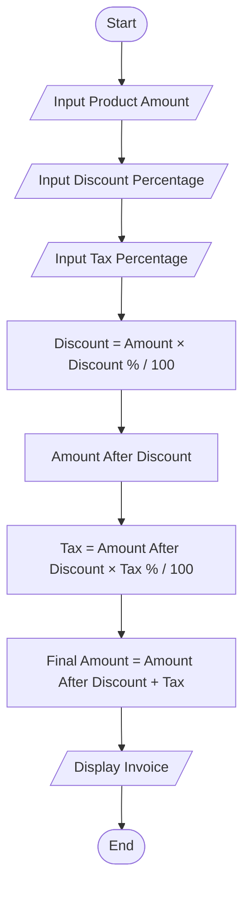
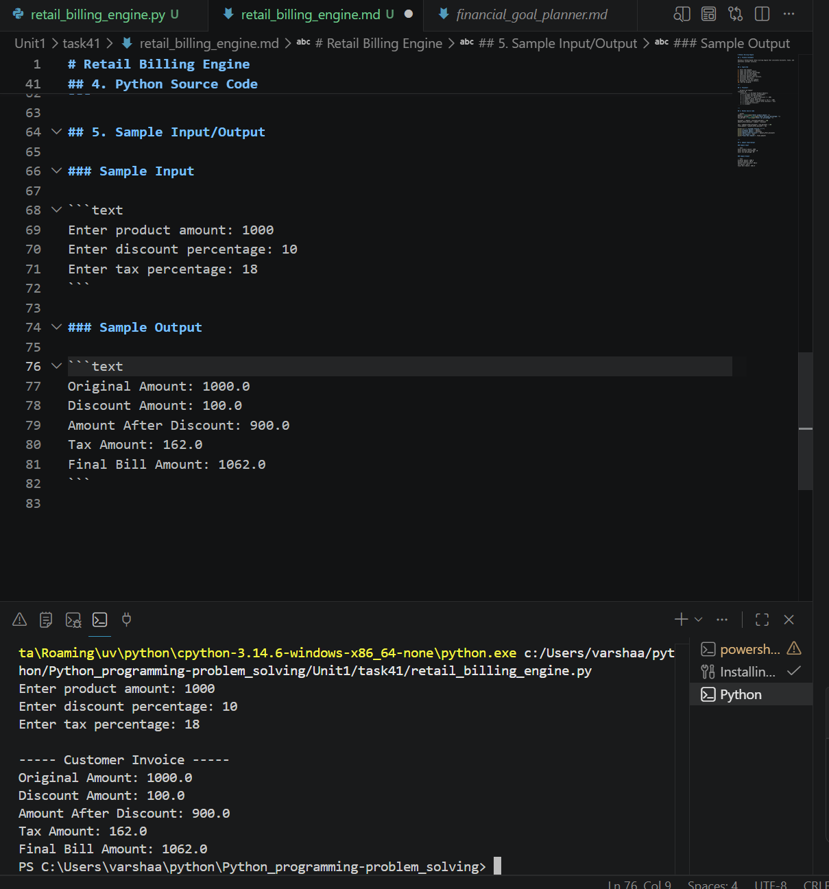

# Retail Billing Engine

## 1. Problem Statement

Develop a Python-based retail billing engine that calculates discounts, taxes, and generates customer invoices.

---

## 2. Algorithm

1. Start the program.
2. Input the product amount.
3. Input the discount percentage.
4. Input the tax percentage.
5. Calculate discount amount.
6. Calculate amount after discount.
7. Calculate tax amount.
8. Calculate final bill amount.
9. Display the invoice details.
10. End the program.

---

## 3. Flowchart



---

## 4. Python Source Code

```python 
amount = float(input("Enter product amount: "))
discount_percent = float(input("Enter discount percentage: "))
tax_percent = float(input("Enter tax percentage: "))

discount = (amount * discount_percent) / 100
amount_after_discount = amount - discount

tax = (amount_after_discount * tax_percent) / 100
final_amount = amount_after_discount + tax

print("\n----- Customer Invoice -----")
print("Original Amount:", amount)
print("Discount Amount:", discount)
print("Amount After Discount:", amount_after_discount)
print("Tax Amount:", tax)
print("Final Bill Amount:", final_amount)
```

---

## 5. Sample Input/Output

### Sample Input

```text 
Enter product amount: 1000
Enter discount percentage: 10
Enter tax percentage: 18
```

### Sample Output

```text 
Original Amount: 1000.0
Discount Amount: 100.0
Amount After Discount: 900.0
Tax Amount: 162.0
Final Bill Amount: 1062.0
```

### screenshot

