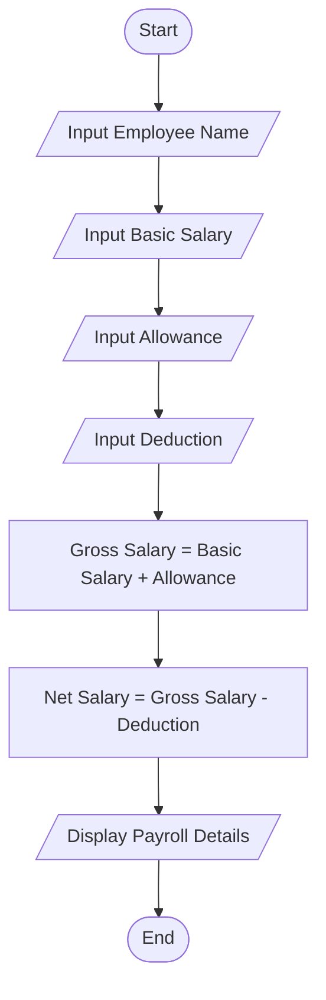
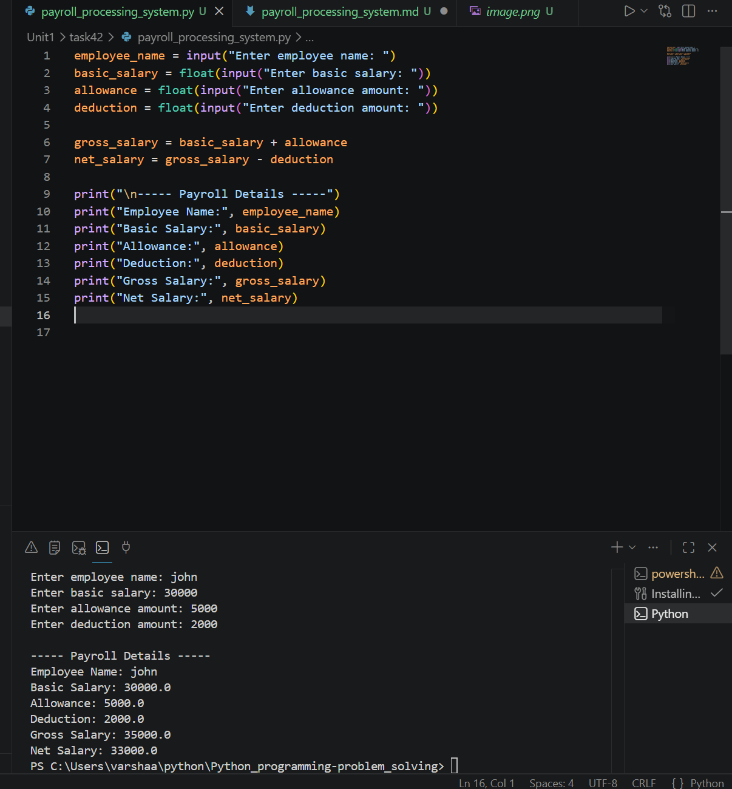

# Payroll Processing System

## 1. Problem Statement

Develop a Python application to automate employee payroll processing and salary calculations.

---

## 2. Algorithm

1. Start the program.
2. Input employee name.
3. Input basic salary.
4. Input allowance amount.
5. Input deduction amount.
6. Calculate gross salary:

   * Gross Salary = Basic Salary + Allowance
7. Calculate net salary:

   * Net Salary = Gross Salary - Deduction
8. Display payroll details.
9. End the program.

---

## 3. Flowchart



---

## 4. Python Source Code

```python 

employee_name = input("Enter employee name: ")
basic_salary = float(input("Enter basic salary: "))
allowance = float(input("Enter allowance amount: "))
deduction = float(input("Enter deduction amount: "))

gross_salary = basic_salary + allowance
net_salary = gross_salary - deduction

print("\n----- Payroll Details -----")
print("Employee Name:", employee_name)
print("Basic Salary:", basic_salary)
print("Allowance:", allowance)
print("Deduction:", deduction)
print("Gross Salary:", gross_salary)
print("Net Salary:", net_salary)
```

---

## 5. Sample Input/Output

### Sample Input

```text 
Enter employee name: John
Enter basic salary: 30000
Enter allowance amount: 5000
Enter deduction amount: 2000
```

### Sample Output

```text 
Employee Name: John
Basic Salary: 30000.0
Allowance: 5000.0
Deduction: 2000.0
Gross Salary: 35000.0
Net Salary: 33000.0
```
### screenshot
