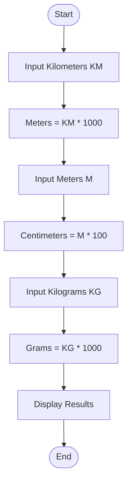
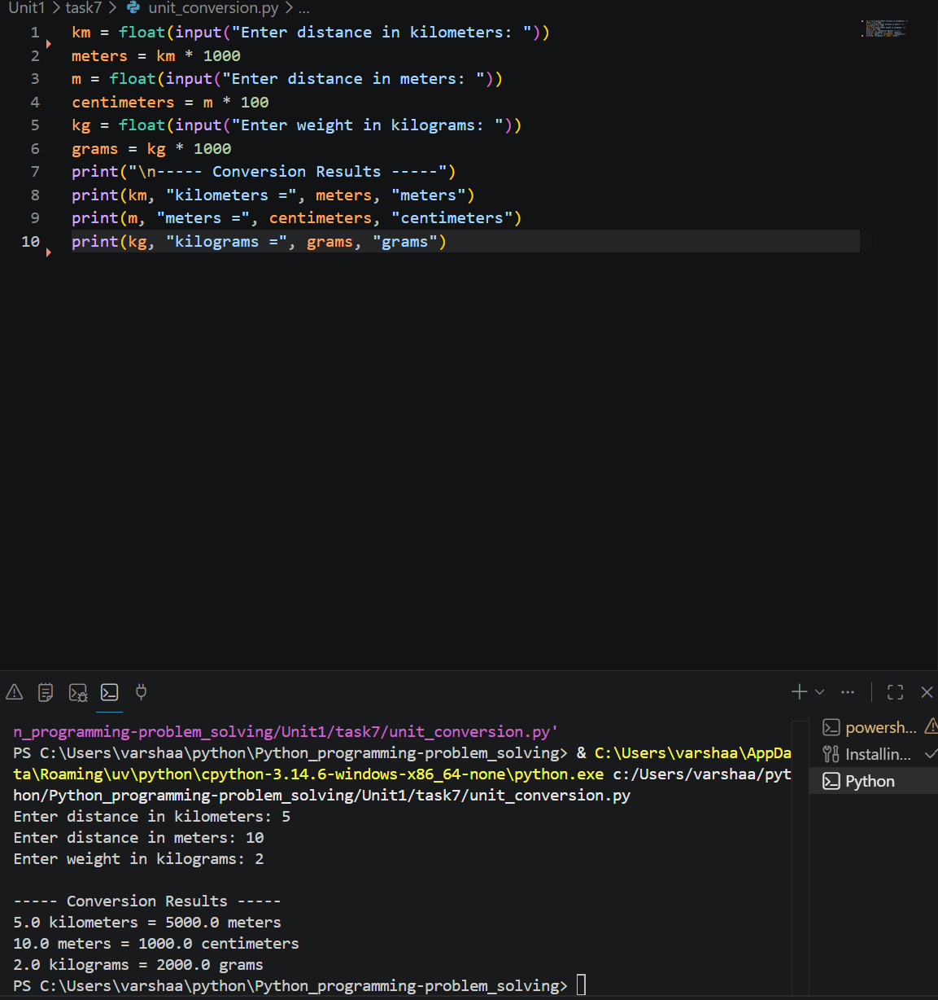

# Unit Conversion Program

## 1. Problem Statement

Write a Python program to convert:

* Kilometers to Meters
* Meters to Centimeters
* Kilograms to Grams

The program should accept input from the user and display the converted values.

---

## 2. Algorithm

1. Start the program.
2. Input distance in kilometers.
3. Convert kilometers to meters using:

   * Meters = Kilometers × 1000
4. Input distance in meters.
5. Convert meters to centimeters using:

   * Centimeters = Meters × 100
6. Input weight in kilograms.
7. Convert kilograms to grams using:

   * Grams = Kilograms × 1000
8. Display the converted values.
9. Stop the program.

---

## 3. Flowchart



---

## 4. Python Source Code

```python


km = float(input("Enter distance in kilometers: "))
meters = km * 1000

km = float(input("Enter distance in meters: "))
centimeters = m * 100


kg = float(input("Enter weight in kilograms: "))
grams = kg * 1000


print("\n----- Conversion Results -----")
print(km, "kilometers =", meters, "meters")
print(m, "meters =", centimeters, "centimeters")
print(kg, "kilograms =", grams, "grams")
```

---

## 5. Sample Input/Output

### Sample Input

```text
Enter distance in kilometers: 5
Enter distance in meters: 10
Enter weight in kilograms: 2
```

### Sample Output

```text
5.0 kilometers = 5000.0 meters
10.0 meters = 1000.0 centimeters
2.0 kilograms = 2000.0 grams
```

### screenshot
