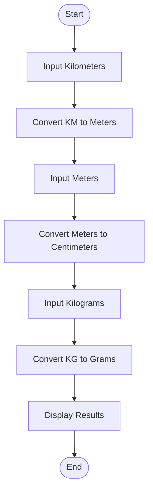
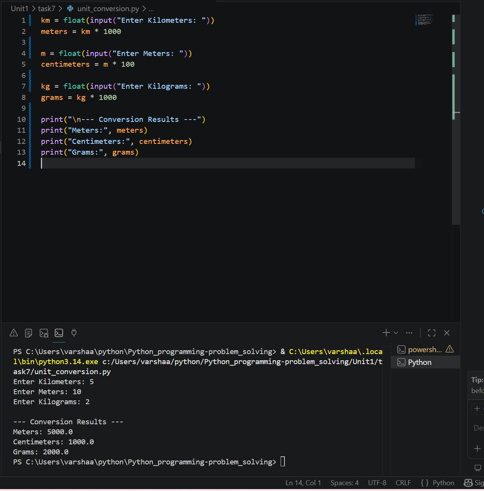

# Tutorial Task 7: Unit Conversion Program

## Problem Statement

Write a Python program to convert kilometers to meters, meters to centimeters, and kilograms to grams.

## Algorithm

1. Input kilometers and convert to meters.
2. Input meters and convert to centimeters.
3. Input kilograms and convert to grams.
4. Display the results.

## Flowchart



## Python Code

```python
km = float(input("Enter Kilometers: "))
meters = km * 1000

m = float(input("Enter Meters: "))
centimeters = m * 100

kg = float(input("Enter Kilograms: "))
grams = kg * 1000

print("\n--- Conversion Results ---")
print("Meters:", meters)
print("Centimeters:", centimeters)
print("Grams:", grams)
```

## Sample Input

```text
Enter Kilometers: 5
Enter Meters: 10
Enter Kilograms: 2
```

## Sample Output

```text
--- Conversion Results ---
Meters: 5000.0
Centimeters: 1000.0
Grams: 2000.0
```

### screenshot
