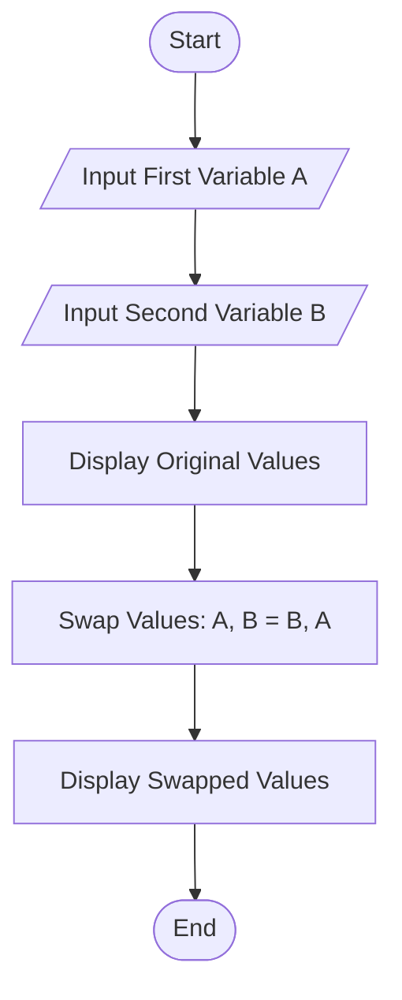
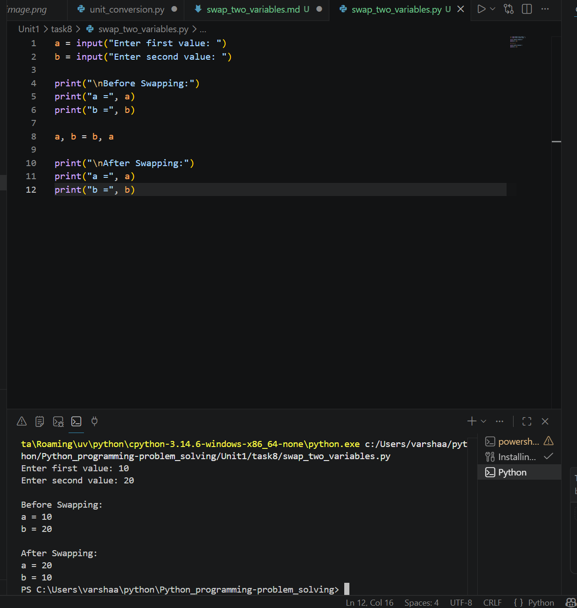

# Swap Two Variables

## 1. Problem Statement

Write a Python program to interchange (swap) the values of two variables and display the result.

---

## 2. Algorithm

1. Start the program.
2. Input two variables `a` and `b`.
3. Display the original values.
4. Swap the values using:

   * `a, b = b, a`
5. Display the swapped values.
6. End the program.

---

## 3. Flowchart



---

## 4. Python Source Code

```python
a = input("Enter first value: ")
b = input("Enter second value: ")

print("\nBefore Swapping:")
print("a =", a)
print("b =", b)

a, b = b, a

print("\nAfter Swapping:")
print("a =", a)
print("b =", b)
```

---

## 5. Sample Input/Output

### Sample Input

```text
Enter first value: 10
Enter second value: 20
```

### Sample Output

```text
Before Swapping:
a = 10
b = 20

After Swapping:
a = 20
b = 10
```

### screenshot

