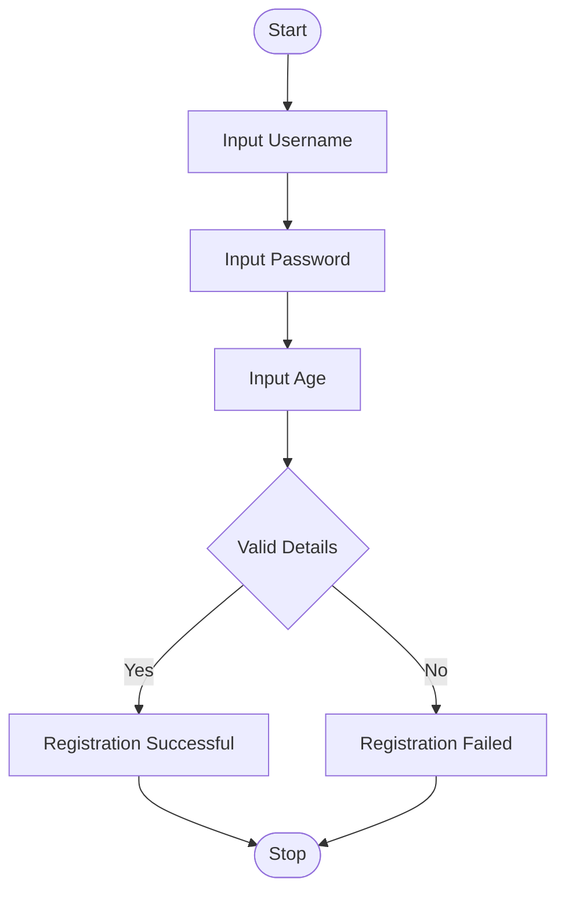
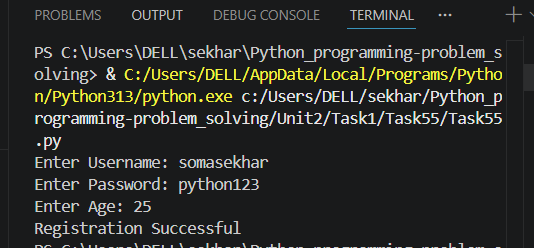

# Tutorial Task 27: User Registration Validator

## 1. Problem Statement

Write a Python program to validate user registration details such as username, password, and age. The registration is successful only if all conditions are satisfied.

### Validation Rules

* Username must contain at least 5 characters.
* Password must contain at least 8 characters.
* Age must be 18 years or above.

---

## 2. Algorithm

1. Start the program.
2. Read username, password, and age from the user.
3. Check whether the username length is at least 5 characters.
4. Check whether the password length is at least 8 characters.
5. Check whether the age is 18 or above.
6. If all conditions are satisfied, display "Registration Successful".
7. Otherwise, display "Registration Failed".
8. Stop the program.

---

## 3. Flowchart (README.md Code)



---

## 4. Python Source Code

```python
username = input("Enter Username: ")
password = input("Enter Password: ")
age = int(input("Enter Age: "))

if len(username) >= 5 and len(password) >= 8 and age >= 18:
    print("Registration Successful")
else:
    print("Registration Failed")
```

---

## 5. Sample Input / Output

### Input

```text
Enter Username: somasekhar
Enter Password: python123
Enter Age: 20
```

### Output

```text
Registration Successful
```

### Another Input

```text
Enter Username: soma
Enter Password: pass
Enter Age: 16
```

### Output

```text
Registration Failed
```

---

## 6. Screenshots (.md Code)

### Source Code Screenshot

```md

```

### Program Output Screenshot


