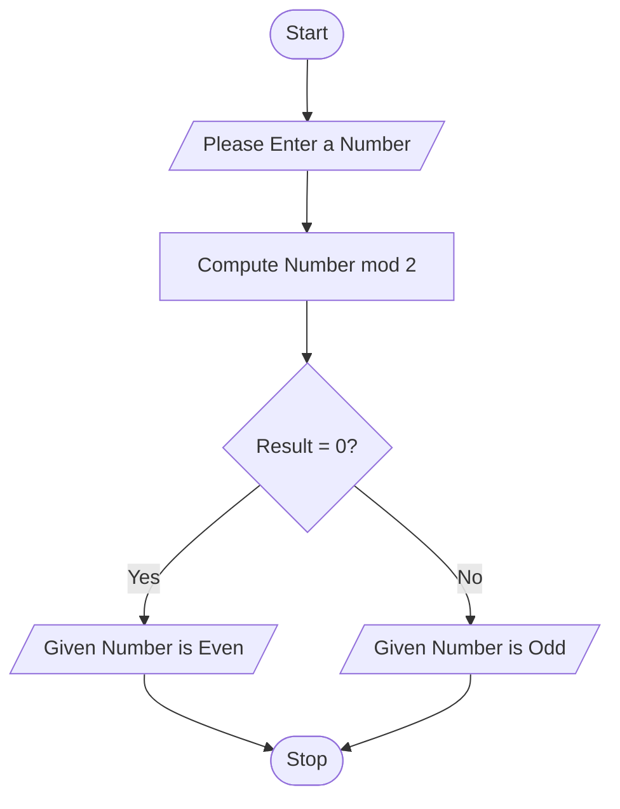

# Unit2 Task 1 : Even or Odd Number Checker

## Problem Statement: Develop a Python program to determine whether a given number is even or odd


## Alogrithm

- Start the program
- Accept a numeric input from user and store it to a varible called userInput
- perfom modulo operation on userInput with 2 and store the value to a variable called Result
- Using IF conditional statement check if the value stored in Result variable is equal to zero or not
- IF the result value is zero then print "Given Number is a Even Number" else Print "Given Number is an Odd Number"
- Stop the program


## Flowchart




## Source Code

```python
userInput = int(input("Please Enter a Number: "))
Result = userInput % 2
if Result == 0:
    print("Given Number is a Even Number")
else:
    print("Given Number is an Odd Number")
```


## Sample Input/Output

```python
Input
Please Enter a number: 25

Output
Given Number is an Odd Number

```

## Screenshots
