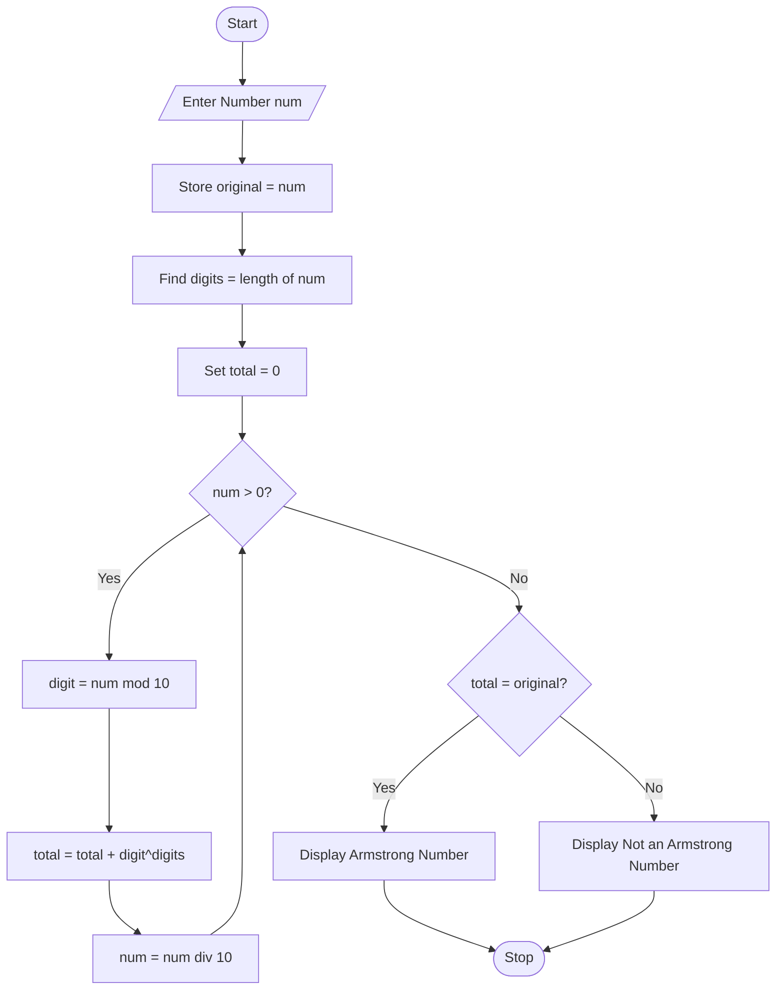

# Armstrong Number Checker Using Python

## 1. Problem Statement

Develop a Python program to determine whether a given number is an Armstrong number.

An **Armstrong Number** (also called a Narcissistic Number) is a number that is equal to the sum of its own digits each raised to the power of the number of digits.

Examples:

```text
153 = 1³ + 5³ + 3³ = 153
370 = 3³ + 7³ + 0³ = 370
371 = 3³ + 7³ + 1³ = 371
407 = 4³ + 0³ + 7³ = 407
```

---

## 2. Algorithm

1. Start the program.
2. Input a number `n`.
3. Store the original number in a variable.
4. Find the number of digits in `n`.
5. Initialize `sum = 0`.
6. Repeat until `n` becomes 0:

   * Extract the last digit using `n % 10`.
   * Raise the digit to the power of the number of digits.
   * Add the result to `sum`.
   * Remove the last digit from `n`.
7. Compare `sum` with the original number.
8. If both are equal:

   * Display "Armstrong Number".
9. Otherwise:

   * Display "Not an Armstrong Number".
10. Stop the program.

---
## 3. Flowchart


## 4. Python Source Code

```python
num = int(input("Enter a number: "))
original = num
digits = len(str(num))
total = 0
while num > 0:
    digit = num % 10
    total += digit ** digits
    num = num // 10
if total == original:
    print(original, "is an Armstrong Number")
else:
    print(original, "is not an Armstrong Number")
```

---

## 5. Sample Input/Output

### Example 1

**Input**

```text
Enter a number: 153
```

**Output**

```text
153 is an Armstrong Number
```

---

### Example 2

**Input**

```text
Enter a number: 370
```

**Output**

```text
370 is an Armstrong Number
```

---

### Example 3

**Input**

```text
Enter a number: 123
```

**Output**

```text
123 is not an Armstrong Number
```

---

## 6. Screenshots


```text
armstrong-number-checker/
│
├── armstrong.py
└── README.md
```
