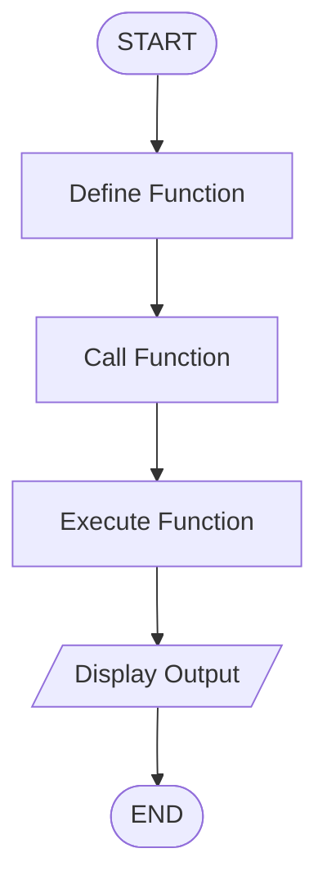

## Basic Function Demonstration
## 1. Problem Statement

Develop a Python program that demonstrates the creation and invocation of user-defined functions.

## 2. Algorithm

1. Start the program.
2. Define a function with required statements.
3. Call the function.
4. Execute the function body.
5. Display the result.
6. Stop.

## 3. Flowchart

## 4. Source Code

def greeting():
    print("Welcome to Python Programming")
    print("This is a user-defined function")

greeting()

## 5. Sample Output

Welcome to Python Programming
This is a user-defined function

## 6. Screenshot

