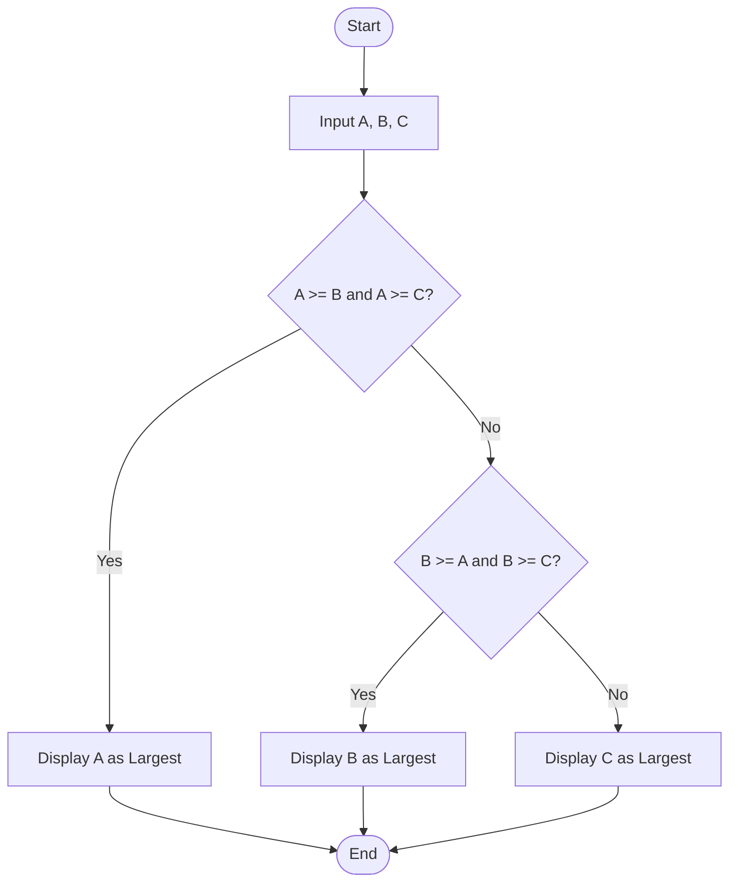
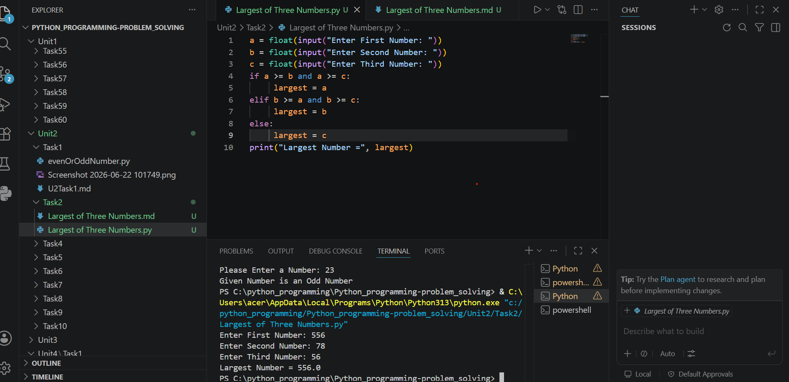

# Tutorial Task 2: Largest of Three Numbers

## Problem Statement

Develop a Python program to identify the largest number among three given numbers.

---

## Algorithm

1. Start

2. Input three numbers: A, B, and C.

3. Compare the numbers:

   * If A is greater than or equal to B and C, then A is the largest.
   * Else if B is greater than or equal to A and C, then B is the largest.
   * Otherwise, C is the largest.

4. Display the largest number.

5. Stop.

---

## Flowchart



---

## Python Source Code

```python
a = float(input("Enter First Number: "))
b = float(input("Enter Second Number: "))
c = float(input("Enter Third Number: "))

if a >= b and a >= c:
    largest = a
elif b >= a and b >= c:
    largest = b
else:
    largest = c

print("Largest Number =", largest)
```

---

## Sample Input/Output

### Input

```text
Enter First Number: 25
Enter Second Number: 40
Enter Third Number: 18
```

### Output

```text
Largest Number = 40.0
```

---

## Screenshot

> Run the program and save the output screenshot as `screenshot.png` in the repository folder.
