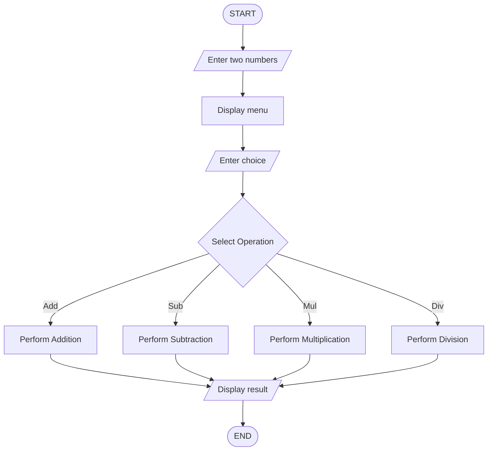

## Calculator Using Functions
## 1. Problem Statement

Develop a Python program that performs arithmetic operations using separate functions.

## 2. Algorithm

1. Start the program.
2. Define separate functions for addition, 
   subtraction, multiplication, and division.
3. Accept two numbers from the user.
4. Display the operation menu.
5. Accept the user's choice.
6. Call the corresponding function based on the choice.
7. Display the calculated result.
8. Stop the program.

## 3. Flowchart

## 4. Source Code

def add(a, b):
    return a + b

def subtract(a, b):
    return a - b

def multiply(a, b):
    return a * b

def divide(a, b):
    return a / b

num1 = float(input("Enter first number: "))
num2 = float(input("Enter second number: "))

print("1. Addition")
print("2. Subtraction")
print("3. Multiplication")
print("4. Division")

choice = int(input("Enter your choice: "))

if choice == 1:
    print("Result =", add(num1, num2))

elif choice == 2:
    print("Result =", subtract(num1, num2))

elif choice == 3:
    print("Result =", multiply(num1, num2))

elif choice == 4:
    print("Result =", divide(num1, num2))

else:
    print("Invalid Choice")

## 5. Sample Input

Enter first number: 20
Enter second number: 10

1. Addition
2. Subtraction
3. Multiplication
4. Division

Enter your choice: 3

## 6. Sample Output

Result = 200

## 7. Screenshot 

